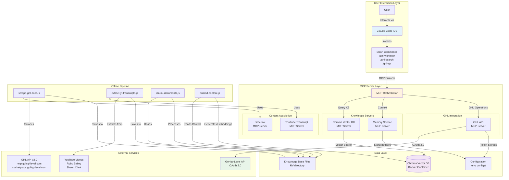
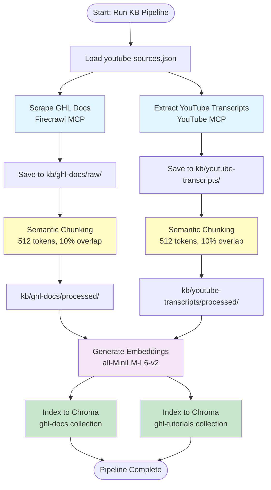
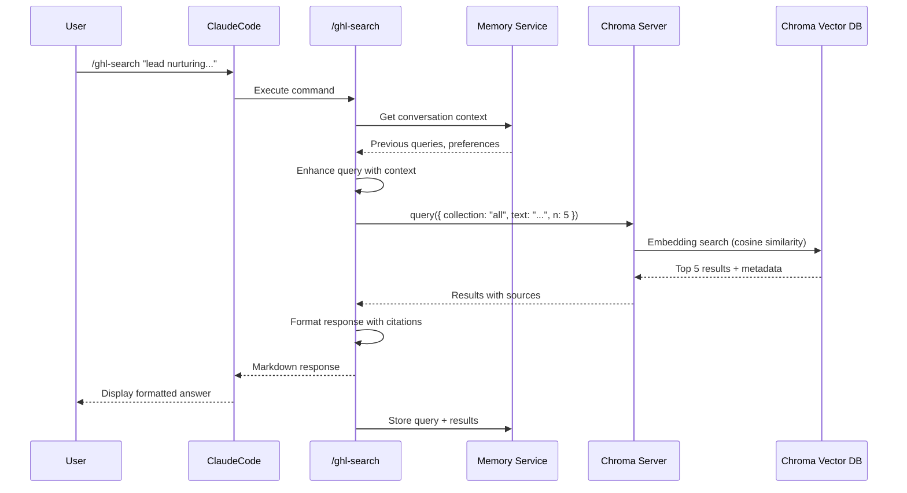
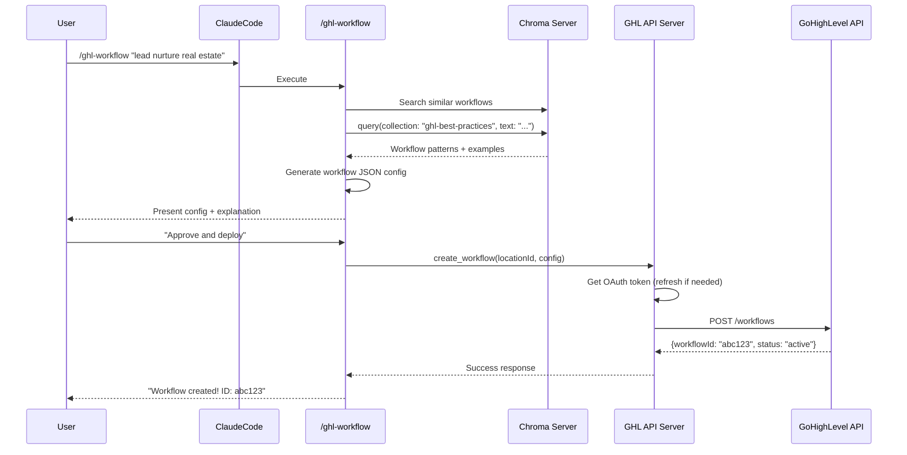
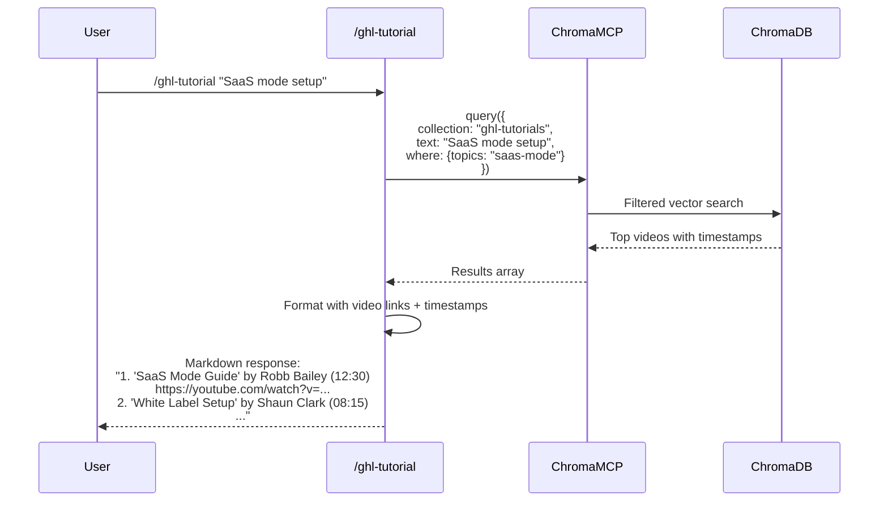

# GHL Wiz Architecture Document

## Document Information

| Field | Value |
|-------|-------|
| **Project Name** | GHL Wiz |
| **Version** | 1.0 |
| **Status** | Draft |
| **Created** | October 25, 2025 |
| **Author** | Architect Agent (Winston) |
| **Owner** | Justin |
| **Related Docs** | [PRD](prd.md), [Project Brief](project-brief.md) |

## Change Log

| Date | Version | Description | Author |
|------|---------|-------------|--------|
| 2025-10-25 | 1.0 | Initial Architecture creation from PRD | Architect Agent (Winston) |

---

## 1. Introduction

This document outlines the complete system architecture for **GHL Wiz**, a comprehensive AI assistant with deep GoHighLevel domain expertise, powered by Retrieval-Augmented Generation (RAG) technology and integrated with Claude Code via the Model Context Protocol (MCP).

### 1.1 Project Context

**Starter Template:** N/A - Greenfield project with custom MCP server development

**Architectural Approach:** Local-first, modular microservices architecture using MCP protocol for component communication, designed for Windows desktop deployment with future cloud migration path.

### 1.2 Design Philosophy

- **Local-First**: All components run on user's Windows machine, no cloud dependencies for MVP
- **Modular**: MCP servers as independent microservices, independently deployable and testable
- **Knowledge-Centric**: RAG architecture with comprehensive knowledge base at the core
- **Developer Experience**: Fast setup, clear documentation, extensible design
- **Performance**: <2 second query response time, optimized embeddings and search
- **Security**: Encrypted OAuth storage, secure API key management, no secrets in version control

---

## 2. High-Level Architecture

### 2.1 Technical Summary

GHL Wiz employs a **modular RAG architecture** with **MCP-based microservices** for knowledge retrieval and API integration. The system consists of a **local vector database** (Chroma) storing embeddings generated from scraped documentation and YouTube transcripts, accessed through specialized **MCP servers** (Knowledge Base, GHL API, YouTube, Firecrawl). Users interact via **Claude Code slash commands** that orchestrate queries to these MCP servers. The **knowledge pipeline** is an offline batch process (scraping, chunking, embedding generation) that populates the vector database. All components run **locally on Windows** using Node.js, TypeScript, and Docker, with OAuth 2.0 authentication for GoHighLevel API integration and automatic token refresh.

###

 2.2 Platform and Infrastructure Choice

**Platform:** Local Windows Desktop (MVP) → Cloud-Ready Architecture (Future)

**Key Services:**
- **Compute**: Node.js 20+ runtime for MCP servers and scripts
- **Storage**:
  - Chroma Vector DB (Docker container, localhost:8000)
  - Local filesystem for knowledge base content (kb/ directory)
  - Encrypted local storage for OAuth tokens
- **Orchestration**: Claude Code MCP configuration (.claude/settings.local.json)
- **Container Runtime**: Docker Desktop for Chroma deployment

**Deployment Host:** User's local Windows machine

**Future Cloud Migration Path:**
- **Vector DB**: Chroma on cloud VM (Azure, AWS, GCP) or managed service
- **MCP Servers**: HTTP transport to cloud functions (Azure Functions, AWS Lambda)
- **Knowledge Base**: Cloud object storage (Azure Blob, S3, GCS)

**Rationale**: Local-first eliminates latency, cost, and privacy concerns for MVP while maintaining cloud-ready architecture for scaling.

### 2.3 Repository Structure

**Structure:** Monorepo

**Rationale:** Single repository simplifies dependency management, versioning, and deployment for a project with tightly coupled components (MCP servers, scripts, slash commands, knowledge base).

**Directory Layout:**

```
C:\Users\justi\BroBro\
├── .bmad-core/                  # BMAD framework files
├── .claude/
│   ├── commands/                # Slash command definitions
│   │   ├── BMad/                # BMAD agent commands
│   │   └── ghl/                 # Custom GHL slash commands
│   └── settings.local.json      # MCP server configuration
├── mcp-servers/
│   ├── ghl-api-server/          # Custom GHL API MCP server
│   │   ├── src/
│   │   │   ├── index.ts         # FastMCP server entry point
│   │   │   ├── tools/           # MCP tool implementations
│   │   │   │   ├── workflows.ts
│   │   │   │   ├── contacts.ts
│   │   │   │   ├── funnels.ts
│   │   │   │   ├── forms.ts
│   │   │   │   └── calendars.ts
│   │   │   └── auth/
│   │   │       └── oauth.ts     # OAuth 2.0 implementation
│   │   ├── dist/                # Compiled JavaScript
│   │   ├── package.json
│   │   └── tsconfig.json
│   └── README.md
├── scripts/                      # Knowledge base pipeline
│   ├── scrape-ghl-docs.js       # Firecrawl documentation scraper
│   ├── extract-yt-transcripts.js # YouTube transcript extractor
│   ├── chunk-documents.js        # Semantic chunking
│   ├── embed-content.js          # Embedding generation
│   ├── build-knowledge-base.js   # Orchestration script
│   └── utils/                    # Shared utilities
├── kb/                           # Knowledge base content
│   ├── youtube-sources.json      # YouTube content configuration
│   ├── ghl-docs/
│   │   ├── raw/                  # Scraped HTML/Markdown
│   │   └── processed/            # Chunked content
│   ├── youtube-transcripts/
│   │   ├── by-creator/
│   │   ├── by-topic/
│   │   └── index.json
│   ├── best-practices/
│   ├── snapshots-reference/
│   └── html-templates/
├── config/                       # Configuration files
│   ├── mcp-servers.json          # MCP server registry
│   ├── embedding-config.json     # Embedding model settings
│   ├── chunking-strategy.json    # Chunking parameters
│   └── ghl-api-scopes.json       # OAuth scopes
├── docs/                         # Documentation
│   ├── prd.md
│   ├── architecture.md (this file)
│   └── project-brief.md
├── tests/                        # Test suites
│   ├── mcp-servers/
│   └── knowledge-base/
├── chroma_db/                    # Chroma persistent storage (gitignored)
├── .env                          # Environment variables (gitignored)
├── .env.example                  # Template
├── .gitignore
├── package.json
├── tsconfig.json
└── README.md
```

### 2.4 High-Level Architecture Diagram



### 2.5 Architectural Patterns

**Pattern Selection & Rationale:**

- **Model Context Protocol (MCP) Microservices:** Modular server architecture where each MCP server is an independent microservice providing specific tools. *Rationale:* Enables independent development, testing, and deployment of knowledge retrieval, API integration, and content acquisition components.

- **Retrieval-Augmented Generation (RAG):** Semantic search over vector database to augment LLM responses with domain-specific knowledge. *Rationale:* Provides factual, up-to-date answers from indexed GHL documentation and tutorials, reducing hallucinations.

- **Offline Batch Processing:** Knowledge base construction (scraping, chunking, embedding) runs as offline batch scripts, not real-time. *Rationale:* Separates expensive indexing from fast query serving, allows for optimized batch operations.

- **Local-First Architecture:** All components run on user's machine with no cloud dependencies. *Rationale:* Zero latency, no recurring costs, privacy-first, simple deployment for MVP.

- **Command Pattern (Slash Commands):** Slash commands as user interface layer invoking MCP server tools. *Rationale:* Declarative, self-documenting interface with clear separation between UI and business logic.

- **Repository Pattern (MCP Tools):** Abstract GHL API operations behind MCP tool interfaces. *Rationale:* Decouples slash commands from API implementation, enables testing with mocks, future API version migration.

- **OAuth 2.0 with Token Refresh:** Automatic token refresh before expiry. *Rationale:* Seamless authentication without user intervention, handles 24-hour token expiry gracefully.

- **Semantic Chunking:** Content split on semantic boundaries (headings, paragraphs) rather than fixed character counts. *Rationale:* Preserves context, improves embedding quality, enhances search relevance.

- **Vector Collections as Namespaces:** Separate Chroma collections for docs, tutorials, best practices, snapshots. *Rationale:* Enables filtered search (e.g., "search only tutorials"), metadata-based retrieval, organized knowledge structure.

---

## 3. Tech Stack

### 3.1 Complete Technology Specification

| Category | Technology | Version | Rationale |
|----------|-----------|---------|-----------|
| **Runtime** | Node.js | 20+ LTS | Long-term support, excellent TypeScript/async support, large MCP ecosystem |
| **Languages** | TypeScript | 5.x | Type safety for MCP servers, better IDE support, reduced bugs |
| | JavaScript (ES Modules) | ES2022 | Scripts and utilities, simpler for batch processing |
| **MCP Framework** | FastMCP (TypeScript) | Latest | Zero boilerplate, Zod validation, built on official SDK, production-ready |
| | @modelcontextprotocol/sdk | Latest | Official SDK for compatibility and standards compliance |
| **Vector Database** | Chroma | Latest | Lightweight, local-first, excellent Python/JS clients, fast setup |
| **Embedding Model** | all-MiniLM-L6-v2 | Latest | 384 dims, 14.7ms/1K tokens, 84% accuracy, perfect for domain queries |
| | (Fallback: BGE-Base-v1.5) | Latest | If accuracy insufficient, higher quality (87%+) at cost of speed |
| **GHL API Client** | @gohighlevel/api-client | 2.2.1 | Official SDK, OAuth 2.0, auto token refresh, comprehensive endpoint coverage |
| **Content Scraping** | Firecrawl MCP | Latest | Robust documentation scraping, sitemap support, rate limiting |
| | Docs Scraper MCP | Latest | Specialized for doc sites, handles complex navigation |
| **YouTube Extraction** | YouTube Transcript Pro | Latest | Production-ready, 4 tools, hybrid architecture (Data API + yt-dlp) |
| | YouTube Intelligence Suite | Latest | Fallback, 8 tools, smart format handling, no API key required |
| **Memory/Context** | Memory Service MCP | Latest | Conversation persistence, session management |
| **Validation** | Zod | Latest | Schema validation for MCP tool inputs, runtime type checking |
| **Testing** | Jest | Latest | Unit/integration tests for MCP servers, wide TypeScript support |
| **Build Tools** | TypeScript Compiler (tsc) | Latest | Compile TS to JS for MCP servers |
| | npm scripts | N/A | Build orchestration, task running |
| **Container Runtime** | Docker Desktop | Latest | Run Chroma in isolated container on Windows |
| **Development** | BMAD-METHOD | 4.x | Agile AI development workflow, systematic story-driven development |
| | ESLint | Latest | Code quality, consistency |
| | Prettier | Latest | Code formatting |
| **IDE Integration** | Claude Code | Latest | Primary user interface, MCP server orchestration |

### 3.2 Alternative Technologies Considered

| Decision | Alternatives Considered | Rationale for Choice |
|----------|------------------------|---------------------|
| **Vector DB** | Qdrant, Pinecone, Weaviate | **Chroma**: Simplest local setup on Windows, Python/JS clients, adequate performance for 10k+ vectors |
| **Embedding Model** | OpenAI Ada-002, BGE-M3, E5-Base | **all-MiniLM-L6-v2**: Fastest (14.7ms/1K), local (no API costs), sufficient accuracy for domain-specific |
| **MCP Framework** | Official SDK only, Custom implementation | **FastMCP**: Reduces boilerplate by 80%, Zod validation, TypeScript-first, rapid development |
| **Chunking** | Fixed-size, Recursive character, LangChain splitters | **Semantic chunking**: Preserves context, respects document structure, best for technical docs |
| **Content Scraping** | Puppeteer, Playwright, Cheerio | **Firecrawl MCP**: Built for docs, handles SPAs, rate limiting, MCP integration out-of-box |

---

## 4. System Architecture

### 4.1 Component Architecture

```mermaid
graph LR
    subgraph "User Layer"
        U[User]
        CC[Claude Code]
    end

    subgraph "Command Layer"
        WF[/ghl-workflow]
        SRC[/ghl-search]
        API[/ghl-api]
        TUT[/ghl-tutorial]
        BP[/ghl-best-practice]
    end

    subgraph "MCP Servers"
        GHL[GHL API Server]
        CHR[Chroma Server]
        MEM[Memory Server]
        YT[YouTube Server]
        FC[Firecrawl Server]
    end

    subgraph "Data Stores"
        VDB[(Chroma Vector DB)]
        FS[File System<br/>kb/]
        CFG[Config & Tokens<br/>.env]
    end

    U -->|Writes command| CC
    CC -->|Routes to| WF
    CC -->|Routes to| SRC
    CC -->|Routes to| API

    WF -->|Query KB| CHR
    WF -->|Create workflow| GHL

    SRC -->|Semantic search| CHR
    SRC -->|Get context| MEM

    API -->|Call GHL API| GHL
    API -->|Get examples| CHR

    TUT -->|Search videos| CHR
    TUT -->|Extract new| YT

    CHR -->|Vector query| VDB
    GHL -->|OAuth| CFG
    GHL -->|HTTP| External_GHL_API
    YT -->|Fetch| External_YouTube
    FC -->|Scrape| External_GHL_Docs

    style CC fill:#bbdefb
    style VDB fill:#d1c4e9
    style External_GHL_API fill:#c8e6c9
```

### 4.2 MCP Server Design

#### 4.2.1 GHL API MCP Server

**Server ID:** `ghl-api`
**Transport:** stdio (local) → HTTP (future cloud)
**Framework:** FastMCP (TypeScript)
**Location:** `mcp-servers/ghl-api-server/`

**Tools Provided:**

```yaml
Tools:
  # Workflows
  - create_workflow:
      parameters:
        - locationId: string (required)
        - name: string (required)
        - trigger: object (required)
        - actions: array<object> (required)
      returns: { workflowId: string, status: string }

  - list_workflows:
      parameters:
        - locationId: string (required)
      returns: array<{id, name, status, trigger}>

  - get_workflow:
      parameters:
        - workflowId: string (required)
      returns: { id, name, trigger, actions, metadata }

  - update_workflow:
      parameters:
        - workflowId: string (required)
        - changes: object (required)
      returns: { workflowId, status }

  - delete_workflow:
      parameters:
        - workflowId: string (required)
      returns: { success: boolean }

  # Contacts
  - create_contact:
      parameters:
        - locationId: string
        - contact: object (email, name, phone, etc.)
      returns: { contactId, status }

  - search_contacts:
      parameters:
        - locationId: string
        - query: string
        - filters: object (optional)
      returns: array<Contact>

  - update_contact:
      parameters:
        - contactId: string
        - updates: object
      returns: { contactId, status }

  # Funnels
  - list_funnels:
      parameters:
        - locationId: string
      returns: array<{id, name, pages, status}>

  - get_funnel_pages:
      parameters:
        - funnelId: string
      returns: array<{pageId, name, url, type}>

  - create_funnel:
      parameters:
        - locationId: string
        - name: string
        - pages: array<object>
      returns: { funnelId, status }

  # Forms
  - list_forms:
      parameters:
        - locationId: string
      returns: array<{formId, name, fields}>

  - get_form_submissions:
      parameters:
        - formId: string
        - dateRange: object (optional)
      returns: array<Submission>

  # Calendars
  - list_calendars:
      parameters:
        - locationId: string
      returns: array<{calendarId, name, slots}>

  - create_appointment:
        parameters:
        - calendarId: string
        - contact: object
        - dateTime: string
      returns: { appointmentId, status }

  # Utilities
  - test_oauth:
      parameters: {}
      returns: { authenticated: boolean, tokenExpiry: string }
```

**OAuth 2.0 Implementation:**

```typescript
// mcp-servers/ghl-api-server/src/auth/oauth.ts

interface OAuthConfig {
  clientId: string;          // from GHL_CLIENT_ID env
  clientSecret: string;      // from GHL_CLIENT_SECRET env
  redirectUri: string;       // localhost callback
  tokenEndpoint: string;     // GHL token URL
}

interface TokenStore {
  accessToken: string;
  refreshToken: string;
  expiresAt: number;         // Unix timestamp
}

class OAuth2Manager {
  private tokenStore: TokenStore;

  async getAccessToken(): Promise<string> {
    if (this.isTokenExpired()) {
      await this.refreshAccessToken();
    }
    return this.tokenStore.accessToken;
  }

  private isTokenExpired(): boolean {
    return Date.now() >= this.tokenStore.expiresAt - 300000; // 5 min buffer
  }

  private async refreshAccessToken(): Promise<void> {
    // Exchange refresh token for new access token
    // Update tokenStore
    // Persist to encrypted file
  }
}
```

**Rate Limiting:**

```typescript
// mcp-servers/ghl-api-server/src/utils/rate-limiter.ts

class RateLimiter {
  private requestQueue: Array<{fn: Function, resolve: Function}> = [];
  private burstLimit = 100;    // 100 req / 10 seconds
  private dailyLimit = 200000; // 200k req / day
  private requestWindow: number[] = [];

  async execute<T>(fn: () => Promise<T>): Promise<T> {
    await this.checkLimits();
    this.recordRequest();
    return await fn();
  }

  private async checkLimits(): Promise<void> {
    // Remove requests outside 10-second window
    // Check if under burst limit
    // Check daily limit
    // Queue and delay if limits exceeded
  }
}
```

#### 4.2.2 Chroma Vector DB MCP Server

**Server ID:** `chroma-db`
**Transport:** HTTP (localhost:8000)
**Framework:** Official Chroma Python server
**Deployment:** Docker container

**Collections:**

```yaml
Collections:
  ghl-docs:
    embedding_dimension: 384
    metadata_schema:
      - doc_title: string
      - doc_url: string
      - section: string
      - category: string (workflows|funnels|api|etc)
      - last_updated: date

  ghl-tutorials:
    embedding_dimension: 384
    metadata_schema:
      - video_title: string
      - creator: string
      - video_url: string
      - timestamp: string
      - duration: integer
      - publish_date: date
      - topics: array<string>

  ghl-best-practices:
    embedding_dimension: 384
    metadata_schema:
      - practice_title: string
      - category: string
      - source: string
      - effectiveness: string (proven|experimental)

  ghl-snapshots:
    embedding_dimension: 384
    metadata_schema:
      - snapshot_name: string
      - marketplace: string (extendly|ghl-central|etc)
      - features: array<string>
      - pricing: string
      - use_cases: array<string>
```

**Query Interface:**

```typescript
// Queried via MCP tools
interface ChromaQuery {
  collection: 'ghl-docs' | 'ghl-tutorials' | 'ghl-best-practices' | 'ghl-snapshots';
  queryText: string;
  nResults?: number;        // default 5
  where?: object;           // metadata filters
  whereDocument?: object;   // document filters
}

// Example usage in slash command
const results = await chromaMCP.query({
  collection: 'ghl-tutorials',
  queryText: 'lead nurturing workflow automation',
  nResults: 5,
  where: { creator: 'Robb Bailey', topics: { $contains: 'workflows' } }
});
```

#### 4.2.3 YouTube MCP Servers

**Primary:** `youtube-transcript-pro`
**Fallback:** `youtube-intelligence`

**Tools:**

```yaml
youtube-transcript-pro:
  - get_transcript:
      parameters:
        - videoId: string
        - language: string (default: 'en')
      returns: { text: string, language: string }

  - get_timed_transcript:
      parameters:
        - videoId: string
      returns: array<{text, start, duration}>

  - get_video_info:
      parameters:
        - videoId: string
      returns: { title, creator, duration, publishDate }
```

#### 4.2.4 Firecrawl MCP Server

**Tools:**

```yaml
firecrawl:
  - scrape:
      parameters:
        - url: string
        - waitFor: integer (ms)
      returns: { markdown: string, html: string, metadata: object }

  - crawl:
      parameters:
        - url: string
        - maxPages: integer
        - includePaths: array<string>
      returns: { pages: array<{url, markdown}> }
```

---

## 5. Knowledge Base Architecture

### 5.1 Data Flow: Content Ingestion Pipeline



### 5.2 Semantic Chunking Algorithm

**Implementation:** `scripts/chunk-documents.js`

```javascript
// Semantic Chunking Strategy

const CHUNK_SIZE = 512;      // tokens
const OVERLAP = 0.10;        // 10%
const OVERLAP_TOKENS = 51;   // 512 * 0.10

function semanticChunk(document) {
  // 1. Parse document structure
  const sections = parseMarkdown(document); // headings, paragraphs, code

  // 2. Tokenize each section
  const tokenized = sections.map(s => ({
    ...s,
    tokens: tokenize(s.content),
    tokenCount: countTokens(s.content)
  }));

  // 3. Group into chunks respecting semantic boundaries
  const chunks = [];
  let currentChunk = [];
  let currentTokens = 0;

  for (const section of tokenized) {
    // If adding section exceeds limit
    if (currentTokens + section.tokenCount > CHUNK_SIZE) {
      // Save current chunk if not empty
      if (currentChunk.length > 0) {
        chunks.push({
          content: currentChunk.join('\n\n'),
          tokens: currentTokens,
          metadata: extractMetadata(currentChunk)
        });
      }

      // Start new chunk with overlap from previous
      currentChunk = getOverlap(chunks[chunks.length - 1], OVERLAP_TOKENS);
      currentTokens = countTokens(currentChunk.join('\n\n'));
    }

    // Add section to current chunk
    currentChunk.push(section.content);
    currentTokens += section.tokenCount;
  }

  // Save final chunk
  if (currentChunk.length > 0) {
    chunks.push({
      content: currentChunk.join('\n\n'),
      tokens: currentTokens,
      metadata: extractMetadata(currentChunk)
    });
  }

  return chunks;
}

function getOverlap(previousChunk, overlapTokens) {
  // Extract last N tokens from previous chunk for context continuity
  const prevContent = previousChunk.content;
  const prevTokens = tokenize(prevContent);
  const overlapStart = Math.max(0, prevTokens.length - overlapTokens);
  return detokenize(prevTokens.slice(overlapStart));
}
```

### 5.3 Embedding Generation

**Model:** `sentence-transformers/all-MiniLM-L6-v2`

**Specifications:**
- **Dimensions:** 384
- **Max Sequence Length:** 256 tokens
- **Performance:** 14.7ms / 1K tokens
- **Accuracy:** 84-85% on semantic similarity benchmarks

**Implementation:** `scripts/embed-content.js`

```javascript
import { pipeline } from '@xenova/transformers';

// Load model (cached after first run)
const embedder = await pipeline('feature-extraction', 'Xenova/all-MiniLM-L6-v2');

async function generateEmbedding(text) {
  const output = await embedder(text, {
    pooling: 'mean',
    normalize: true
  });

  return Array.from(output.data); // 384-dimensional vector
}

async function batchEmbed(chunks) {
  const embeddings = [];

  for (const chunk of chunks) {
    const embedding = await generateEmbedding(chunk.content);

    embeddings.push({
      id: chunk.id,
      embedding: embedding,
      metadata: chunk.metadata,
      document: chunk.content
    });
  }

  return embeddings;
}
```

### 5.4 Vector Database Schema

**Chroma Configuration:**

```yaml
# Chroma running in Docker
# docker run -p 8000:8000 -v ./chroma_db:/chroma/chroma chromadb/chroma

Collections:
  ghl-docs:
    size: ~5,000 vectors (estimated)
    sources: help.gohighlevel.com, marketplace.gohighlevel.com/docs
    update_frequency: monthly

  ghl-tutorials:
    size: ~2,000 vectors (50-100 videos * ~20-40 chunks each)
    sources: YouTube transcripts (Robb Bailey, Shaun Clark, GHL Official)
    update_frequency: quarterly

  ghl-best-practices:
    size: ~500 vectors
    sources: curated guides, community knowledge
    update_frequency: as-needed

  ghl-snapshots:
    size: ~200 vectors
    sources: marketplace snapshot information
    update_frequency: quarterly

Total Estimated Vectors: ~7,700
Total Storage: ~11 MB (7,700 * 384 dims * 4 bytes)
```

**Index Configuration:**

```python
# Chroma uses HNSW (Hierarchical Navigable Small World) by default
# Optimized for fast approximate nearest neighbor search

collection.modify(
    metadata={
        "hnsw:space": "cosine",        # cosine similarity for semantic search
        "hnsw:construction_ef": 200,   # higher = better recall, slower indexing
        "hnsw:search_ef": 100,         # higher = better recall, slower queries
        "hnsw:M": 16                   # connections per layer
    }
)
```

---

## 6. Request/Response Flows

### 6.1 Knowledge Query Flow

**User invokes:** `/ghl-search "lead nurturing workflow best practices"`



**Latency Budget:**
- Embedding generation: ~15ms
- Vector search: ~50ms
- Result formatting: ~10ms
- **Total: ~75ms** (well under 2 second requirement)

### 6.2 Workflow Creation Flow

**User invokes:** `/ghl-workflow "create lead nurture for real estate"`



### 6.3 Tutorial Discovery Flow

**User invokes:** `/ghl-tutorial "SaaS mode setup"`



---

## 7. Deployment Architecture

### 7.1 Local Deployment (MVP)

**Target Environment:** Windows Desktop (Windows 10/11)

**Prerequisites:**
- Node.js 20+ LTS
- Docker Desktop
- Git
- Text editor (VS Code recommended for Claude Code)

**Deployment Steps:**

```bash
# 1. Clone repository
git clone <repo-url>
cd "C:\Users\justi\BroBro"

# 2. Install dependencies
npm install

# 3. Set up environment
cp .env.example .env
# Edit .env with GHL OAuth credentials, Firecrawl API key

# 4. Start Chroma Vector DB
docker run -d -p 8000:8000 -v ./chroma_db:/chroma/chroma chromadb/chroma

# 5. Configure MCP servers in Claude Code
# Claude Code reads .claude/settings.local.json automatically

# 6. Build GHL API MCP server
cd mcp-servers/ghl-api-server
npm install
npm run build

# 7. Run knowledge base pipeline (first time only)
node scripts/build-knowledge-base.js

# 8. Open project in Claude Code
# MCP servers auto-start when Claude Code loads project
```

**Runtime Architecture:**

```
┌─────────────────────────────────────────────┐
│         Windows Desktop (localhost)         │
├─────────────────────────────────────────────┤
│                                             │
│  ┌─────────────┐  ┌──────────────────────┐ │
│  │ Claude Code │  │  MCP Servers         │ │
│  │             │  │  ├─ ghl-api (stdio) │ │
│  │  Slash      │──┼──├─ chroma (HTTP)    │ │
│  │  Commands   │  │  ├─ memory (HTTP)    │ │
│  │             │  │  ├─ youtube (npx)    │ │
│  │             │  │  └─ firecrawl (npx)  │ │
│  └─────────────┘  └──────────────────────┘ │
│                                             │
│  ┌─────────────────────────────────────┐   │
│  │ Docker Desktop                      │   │
│  │  └─ Chroma Container (port 8000)   │   │
│  └─────────────────────────────────────┘   │
│                                             │
│  ┌─────────────────────────────────────┐   │
│  │ File System                         │   │
│  │  ├─ kb/ (knowledge base content)   │   │
│  │  ├─ chroma_db/ (vector storage)    │   │
│  │  └─ .env (OAuth tokens, API keys)  │   │
│  └─────────────────────────────────────┘   │
└─────────────────────────────────────────────┘
```

### 7.2 MCP Server Configuration

**File:** `.claude/settings.local.json`

```json
{
  "permissions": {
    "allow": [
      "Bash(npx @anthropic-ai/mcp-doctor list-servers)",
      "Bash(dir:*)",
      "Bash(where:*)",
      "Bash(claude mcp list:*)"
    ]
  },
  "mcp": {
    "servers": {
      "ghl-api": {
        "command": "node",
        "args": ["./mcp-servers/ghl-api-server/dist/index.js"],
        "env": {
          "GHL_CLIENT_ID": "${GHL_CLIENT_ID}",
          "GHL_CLIENT_SECRET": "${GHL_CLIENT_SECRET}",
          "NODE_ENV": "production"
        }
      },
      "chroma-db": {
        "transport": "http",
        "url": "http://localhost:8000"
      },
      "memory-service": {
        "transport": "http",
        "url": "http://localhost:8001"
      },
      "youtube-transcript-pro": {
        "command": "npx",
        "args": ["@thisis-romar/mcp-youtube-transcript-pro"]
      },
      "youtube-intelligence": {
        "command": "npx",
        "args": ["@of3y/mcp-youtube-transcript"]
      },
      "firecrawl": {
        "command": "npx",
        "args": ["@firecrawl/mcp-server"],
        "env": {
          "FIRECRAWL_API_KEY": "${FIRECRAWL_API_KEY}"
        }
      }
    }
  }
}
```

### 7.3 Cloud Migration Path (Future)

**Phase 1: Hybrid (Local + Cloud Vector DB)**

```
User Machine:
  - Claude Code
  - MCP servers (stdio)

Cloud (Azure/AWS/GCP):
  - Chroma on VM (HTTP transport)
  - Benefits: Multi-device access, persistent storage
```

**Phase 2: Fully Cloud-Deployed**

```
User Machine:
  - Claude Code only

Cloud:
  - MCP servers as HTTP endpoints (Azure Functions, AWS Lambda)
  - Chroma managed service
  - Object storage for KB content

Benefits:
  - No local setup
  - Auto-scaling
  - Team access
  - Centralized updates
```

**Migration Checklist:**
1. ✅ Test Chroma HTTP transport locally
2. Deploy Chroma to cloud VM
3. Update `.claude/settings.local.json` with cloud URL
4. Containerize GHL API MCP server (Docker)
5. Deploy to cloud functions
6. Migrate to HTTP transport
7. Update slash commands to use HTTP MCP servers

---

## 8. Security Architecture

### 8.1 Threat Model

| Threat | Impact | Mitigation |
|--------|--------|------------|
| **OAuth token leakage** | High | Encrypted storage, never in git, auto-rotation |
| **API key exposure** | High | Environment variables only, .env in .gitignore |
| **Man-in-the-middle attacks** | Medium | HTTPS for all external API calls (GHL, YouTube, Firecrawl) |
| **Unauthorized MCP access** | Low | Local-only MCP servers (stdio/localhost), no external exposure |
| **Malicious knowledge injection** | Medium | Curated sources only, manual review of YouTube channels |
| **Rate limit abuse** | Low | Built-in rate limiting, queue management |

### 8.2 Secrets Management

**OAuth Tokens:**

```typescript
// mcp-servers/ghl-api-server/src/auth/token-storage.ts

import crypto from 'crypto';
import fs from 'fs/promises';

const ENCRYPTION_KEY = process.env.ENCRYPTION_KEY; // 32-byte key
const TOKEN_FILE = './.tokens.enc';

interface EncryptedTokens {
  iv: string;
  encryptedData: string;
}

async function saveTokens(tokens: TokenStore): Promise<void> {
  const iv = crypto.randomBytes(16);
  const cipher = crypto.createCipheriv('aes-256-cbc', ENCRYPTION_KEY, iv);

  let encrypted = cipher.update(JSON.stringify(tokens), 'utf8', 'hex');
  encrypted += cipher.final('hex');

  await fs.writeFile(TOKEN_FILE, JSON.stringify({
    iv: iv.toString('hex'),
    encryptedData: encrypted
  }));
}

async function loadTokens(): Promise<TokenStore> {
  const data: EncryptedTokens = JSON.parse(await fs.readFile(TOKEN_FILE, 'utf8'));
  const decipher = crypto.createDecipheriv(
    'aes-256-cbc',
    ENCRYPTION_KEY,
    Buffer.from(data.iv, 'hex')
  );

  let decrypted = decipher.update(data.encryptedData, 'hex', 'utf8');
  decrypted += decipher.final('utf8');

  return JSON.parse(decrypted);
}
```

**`.gitignore` (Critical):**

```
.env
.tokens.enc
chroma_db/
kb/ghl-docs/raw/
kb/youtube-transcripts/by-creator/
node_modules/
dist/
*.log
```

### 8.3 API Security

**GHL API Calls:**

```typescript
// All API calls use HTTPS
const GHL_BASE_URL = 'https://services.leadconnectorhq.com';

// Headers for every request
const headers = {
  'Authorization': `Bearer ${accessToken}`,
  'Version': '2021-04-15',  // Required by GHL API v2
  'Content-Type': 'application/json'
};

// Validate SSL certificates
const httpsAgent = new https.Agent({ rejectUnauthorized: true });
```

---

## 9. Performance Optimization

### 9.1 Query Optimization

**Caching Strategy:**

```typescript
// In-memory LRU cache for frequent queries
import LRU from 'lru-cache';

const queryCache = new LRU({
  max: 500,        // cache 500 queries
  ttl: 1000 * 60 * 60  // 1 hour TTL
});

async function cachedQuery(queryText: string, collection: string) {
  const cacheKey = `${collection}:${queryText}`;

  if (queryCache.has(cacheKey)) {
    return queryCache.get(cacheKey);
  }

  const results = await chromaDB.query({ collection, queryText });
  queryCache.set(cacheKey, results);

  return results;
}
```

**Lazy Loading:**

```typescript
// Load embeddings on-demand, not all at once
async function getEmbedding(text: string): Promise<number[]> {
  if (!embeddingModel) {
    embeddingModel = await loadModel('all-MiniLM-L6-v2');
  }
  return await embeddingModel.encode(text);
}
```

### 9.2 Batch Processing

**Knowledge Base Indexing:**

```javascript
// scripts/embed-content.js

const BATCH_SIZE = 100;

async function batchIndex(chunks) {
  for (let i = 0; i < chunks.length; i += BATCH_SIZE) {
    const batch = chunks.slice(i, i + BATCH_SIZE);

    // Generate embeddings in parallel
    const embeddings = await Promise.all(
      batch.map(chunk => generateEmbedding(chunk.content))
    );

    // Batch insert to Chroma
    await chromaCollection.add({
      ids: batch.map(c => c.id),
      embeddings: embeddings,
      metadatas: batch.map(c => c.metadata),
      documents: batch.map(c => c.content)
    });

    console.log(`Indexed ${i + batch.length} / ${chunks.length}`);
  }
}
```

### 9.3 Performance Metrics

**Target Metrics:**

| Metric | Target | Measurement |
|--------|--------|-------------|
| Query latency (p95) | <2 seconds | Time from slash command to response |
| Embedding generation | <20ms/chunk | all-MiniLM-L6-v2 inference time |
| Vector search | <100ms | Chroma query time for top-5 results |
| MCP server startup | <5 seconds | Time for all servers to be ready |
| Memory footprint | <4GB RAM | Chroma + all MCP servers + Node.js |
| Indexing throughput | >50 docs/min | Knowledge base pipeline |

**Monitoring:**

```javascript
// Simple performance logging
const performanceLog = {
  queryLatencies: [],
  embeddingTimes: [],

  logQuery(durationMs) {
    this.queryLatencies.push(durationMs);
    if (durationMs > 2000) {
      console.warn(`Slow query: ${durationMs}ms`);
    }
  },

  getP95() {
    const sorted = this.queryLatencies.sort((a, b) => a - b);
    return sorted[Math.floor(sorted.length * 0.95)];
  }
};
```

---

## 10. Extensibility & Future Enhancements

### 10.1 Adding New MCP Servers

**Example: Context7 for Dev Documentation**

```json
// .claude/settings.local.json

{
  "mcp": {
    "servers": {
      "context7": {
        "command": "npx",
        "args": ["@upstash/context7-mcp"],
        "env": {
          "CONTEXT7_API_KEY": "${CONTEXT7_API_KEY}"
        }
      }
    }
  }
}
```

**Use Case:** Get up-to-date docs for FastMCP, TypeScript, Chroma when developing GHL Wiz extensions.

### 10.2 Adding New Slash Commands

**Example: `/ghl-analyze-workflow`**

```markdown
<!-- .claude/commands/ghl/analyze-workflow.md -->

# /ghl-analyze-workflow

Analyze an existing GoHighLevel workflow for optimization opportunities.

## Usage

/ghl-analyze-workflow [workflowId]

## Steps

1. Use GHL API MCP tool to fetch workflow configuration
2. Query knowledge base for best practices related to workflow type
3. Analyze for:
   - Inefficient trigger/action combinations
   - Missing error handling
   - Opportunities for automation
   - A/B testing suggestions
4. Provide detailed recommendations with references to docs/tutorials
```

### 10.3 Cloud Deployment Extensions

**Azure Functions Example:**

```typescript
// Azure Function HTTP trigger for GHL API MCP server

import { AzureFunction, Context, HttpRequest } from "@azure/functions";
import { MCPServer } from './mcp-server';

const httpTrigger: AzureFunction = async function (
  context: Context,
  req: HttpRequest
): Promise<void> {
  const mcpServer = new MCPServer();
  const response = await mcpServer.handleRequest(req.body);

  context.res = {
    status: 200,
    body: response
  };
};

export default httpTrigger;
```

### 10.4 Multi-Language Support

**Future Enhancement:**

```json
// config/languages.json

{
  "supported": ["en", "es", "pt"],
  "embedding_models": {
    "en": "all-MiniLM-L6-v2",
    "es": "paraphrase-multilingual-MiniLM-L12-v2",
    "pt": "paraphrase-multilingual-MiniLM-L12-v2"
  },
  "youtube_transcripts": {
    "fallback_languages": ["en-US", "es-ES", "pt-BR"]
  }
}
```

### 10.5 Community Contributions

**Future: Community Workflow Templates**

```
kb/community/
  ├── workflows/
  │   ├── real-estate-nurture.json
  │   ├── ecommerce-abandoned-cart.json
  │   └── ...
  ├── snapshots/
  │   └── user-contributed-snapshots.md
  └── best-practices/
      └── industry-specific/
          ├── real-estate.md
          ├── healthcare.md
          └── ...
```

---

## 11. Testing Strategy

### 11.1 Unit Tests

**MCP Server Tools:**

```typescript
// tests/mcp-servers/ghl-api/workflows.test.ts

import { describe, it, expect, vi } from 'vitest';
import { createWorkflow } from '../../../mcp-servers/ghl-api-server/src/tools/workflows';

describe('GHL API MCP - Workflows', () => {
  it('should create workflow with valid config', async () => {
    const mockGHLClient = {
      workflows: {
        create: vi.fn().mockResolvedValue({ id: 'wf_123', status: 'active' })
      }
    };

    const result = await createWorkflow(mockGHLClient, {
      locationId: 'loc_456',
      name: 'Test Workflow',
      trigger: { type: 'form_submitted' },
      actions: [{ type: 'send_email', template: 'welcome' }]
    });

    expect(result.workflowId).toBe('wf_123');
    expect(mockGHLClient.workflows.create).toHaveBeenCalledTimes(1);
  });

  it('should handle rate limit errors', async () => {
    const mockGHLClient = {
      workflows: {
        create: vi.fn().mockRejectedValue({ status: 429, message: 'Rate limit' })
      }
    };

    await expect(createWorkflow(mockGHLClient, {...}))
      .rejects.toThrow('Rate limit exceeded');
  });
});
```

### 11.2 Integration Tests

**End-to-End Slash Command:**

```typescript
// tests/integration/search-command.test.ts

import { executeSlashCommand } from '../helpers/claude-code-mock';
import { chromaDB } from '../helpers/test-db';

describe('Integration: /ghl-search', () => {
  beforeAll(async () => {
    // Seed test database
    await chromaDB.collection('ghl-docs').add({
      ids: ['doc1'],
      documents: ['Workflows in GoHighLevel allow automation...'],
      metadatas: [{ title: 'Workflow Overview', url: 'https://...' }]
    });
  });

  it('should return relevant docs with citations', async () => {
    const response = await executeSlashCommand('/ghl-search', 'workflow automation');

    expect(response).toContain('Workflows in GoHighLevel');
    expect(response).toContain('Source: Workflow Overview');
    expect(response).toContain('https://');
  });

  it('should complete in under 2 seconds', async () => {
    const start = Date.now();
    await executeSlashCommand('/ghl-search', 'lead nurturing');
    const duration = Date.now() - start;

    expect(duration).toBeLessThan(2000);
  });
});
```

### 11.3 Performance Benchmarks

**Query Latency Benchmark:**

```typescript
// tests/benchmarks/query-performance.test.ts

describe('Performance: Knowledge Base Queries', () => {
  it('should achieve p95 < 2 seconds for 100 queries', async () => {
    const latencies = [];

    for (let i = 0; i < 100; i++) {
      const start = Date.now();
      await chromaDB.query({
        collection: 'ghl-docs',
        queryText: generateRandomQuery(),
        nResults: 5
      });
      latencies.push(Date.now() - start);
    }

    const p95 = getPercentile(latencies, 0.95);
    expect(p95).toBeLessThan(2000);
  });
});
```

---

## 12. Operational Considerations

### 12.1 Logging

**Structured Logging:**

```typescript
// mcp-servers/ghl-api-server/src/utils/logger.ts

import winston from 'winston';

const logger = winston.createLogger({
  level: 'info',
  format: winston.format.combine(
    winston.format.timestamp(),
    winston.format.json()
  ),
  transports: [
    new winston.transports.File({ filename: 'logs/error.log', level: 'error' }),
    new winston.transports.File({ filename: 'logs/combined.log' }),
    new winston.transports.Console({ format: winston.format.simple() })
  ]
});

// Usage
logger.info('Workflow created', { workflowId: 'wf_123', locationId: 'loc_456' });
logger.error('OAuth token refresh failed', { error: err.message });
```

### 12.2 Error Handling

**MCP Server Error Responses:**

```typescript
// Standardized error format

interface MCPError {
  code: string;
  message: string;
  details?: any;
  retryable: boolean;
}

try {
  const result = await ghlClient.workflows.create(config);
  return { success: true, data: result };
} catch (error) {
  if (error.status === 429) {
    return {
      success: false,
      error: {
        code: 'RATE_LIMIT_EXCEEDED',
        message: 'GoHighLevel API rate limit reached. Retrying in 10 seconds...',
        retryable: true
      }
    };
  }

  if (error.status === 401) {
    return {
      success: false,
      error: {
        code: 'AUTH_FAILED',
        message: 'OAuth token expired. Please re-authenticate.',
        retryable: false
      }
    };
  }

  // Generic error
  return {
    success: false,
    error: {
      code: 'UNKNOWN_ERROR',
      message: error.message,
      retryable: false
    }
  };
}
```

### 12.3 Monitoring & Health Checks

**MCP Server Health:**

```typescript
// Add health check tool to each MCP server

{
  name: 'health_check',
  description: 'Check server health and dependencies',
  parameters: {},
  handler: async () => {
    const checks = {
      server: 'ok',
      ghl_api: await checkGHLConnection(),
      oauth_token: await checkOAuthToken(),
      rate_limit: getRateLimitStatus()
    };

    return {
      status: Object.values(checks).every(v => v === 'ok' || v.status === 'ok') ? 'healthy' : 'degraded',
      checks
    };
  }
}
```

---

## 13. Appendix

### 13.1 Glossary

| Term | Definition |
|------|------------|
| **MCP** | Model Context Protocol - Standard for AI assistant tool integration |
| **RAG** | Retrieval-Augmented Generation - LLM + knowledge base architecture |
| **GHL** | GoHighLevel - Marketing automation SaaS platform |
| **Embedding** | Numerical vector representation of text for semantic search |
| **Vector DB** | Database optimized for similarity search over embeddings |
| **Semantic Chunking** | Splitting documents on meaning boundaries, not character counts |
| **OAuth 2.0** | Industry-standard protocol for authorization |
| **Slash Command** | User interface pattern for invoking assistant capabilities |

### 13.2 Related Documents

- [PRD](prd.md) - Product Requirements Document
- [Project Brief](project-brief.md) - Initial project proposal
- [KB README](../kb/README.md) - Knowledge base management guide
- [BMAD User Guide](../.bmad-core/user-guide.md) - Development workflow

### 13.3 Technology References

**Official Documentation:**
- [Model Context Protocol Spec](https://modelcontextprotocol.io/)
- [FastMCP Framework](https://github.com/punkpeye/fastmcp)
- [Chroma Documentation](https://docs.trychroma.com/)
- [GoHighLevel API v2](https://marketplace.gohighlevel.com/docs/)
- [sentence-transformers](https://www.sbert.net/)

**Research Papers:**
- Semantic Chunking Strategies (2024)
- RAG Architecture Best Practices (2025)

---

**End of Architecture Document**

**Next Steps:**

1. Review architecture with stakeholders
2. Run architect checklist (`*execute-checklist`)
3. Proceed to PO for document sharding into stories
4. Begin Epic 1 implementation with SM/Dev agents

---

**Document Status:** ✅ Complete - Ready for Review
