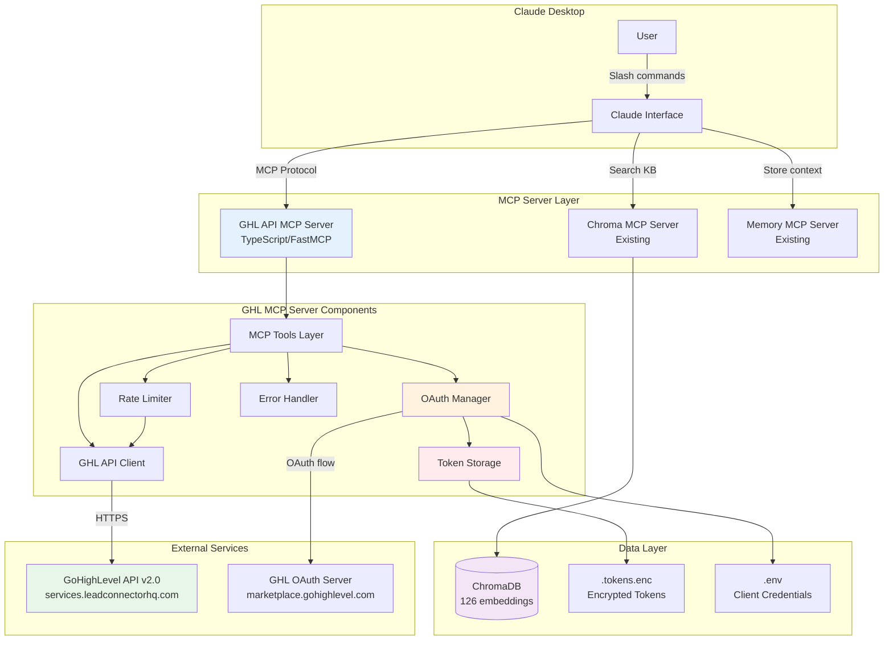
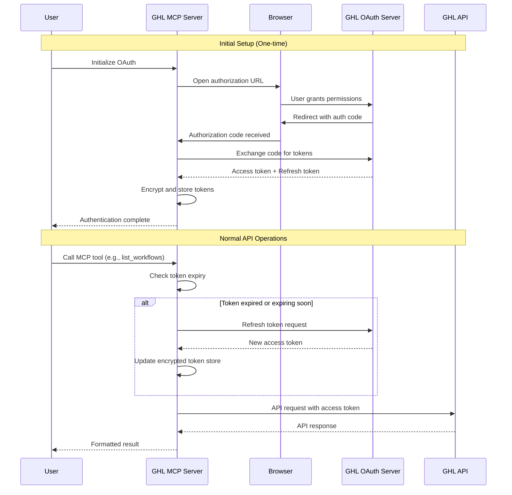
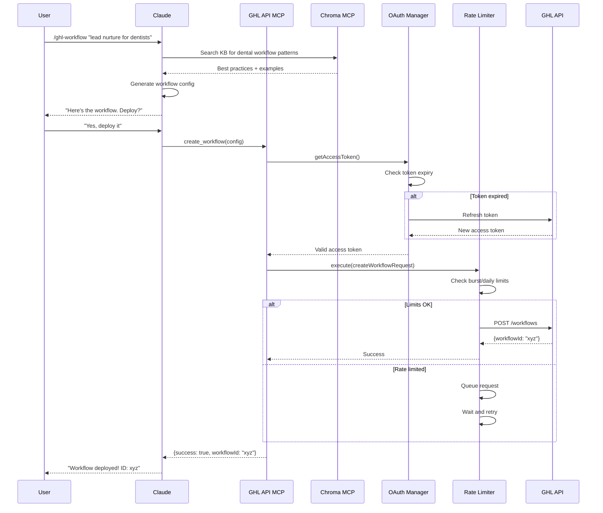
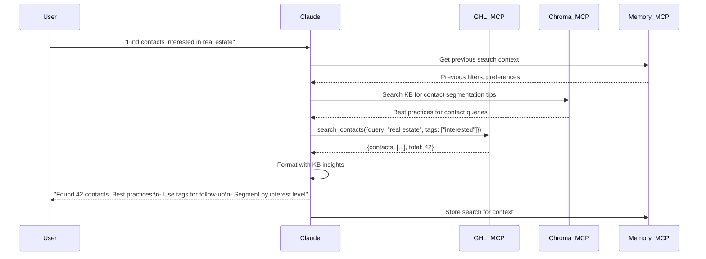

# 13. MCP Server Architecture (Epic 3)

## 13.1 Overview

This document defines the architecture for Epic 3: Custom GHL API MCP Server Implementation. The design integrates OAuth 2.0 authentication with GoHighLevel's API v2.0, exposing MCP tools for Claude Desktop to query the existing knowledge base and interact with GHL API endpoints.

**Key Objectives:**
- Seamless OAuth 2.0 authentication with automatic token refresh
- Rate-limited API interactions respecting GHL's constraints (100 req/10s, 200k/day)
- Integration with existing ChromaDB knowledge base (126 embeddings operational)
- Secure token storage and credential management
- Comprehensive error handling and retry logic
- Multi-location/sub-account support

**Integration Points with Epic 1-2:**
- ChromaDB vector database (ghl-knowledge-base collection, 126 embeddings)
- Semantic search capabilities via existing Chroma MCP server
- Knowledge base content in kb/ directory
- Existing MCP server infrastructure (Memory Service, Chroma, YouTube, Firecrawl)

---

## 13.2 High-Level MCP Server Architecture



---

## 13.3 OAuth 2.0 Authentication Architecture

### 13.3.1 OAuth Flow Implementation

**Flow Type:** Authorization Code Grant (OAuth 2.0)



### 13.3.2 OAuth Configuration

**OAuth Endpoints:**
```typescript
const OAUTH_CONFIG = {
  authorizationUrl: 'https://marketplace.gohighlevel.com/oauth/chooselocation',
  tokenUrl: 'https://services.leadconnectorhq.com/oauth/token',
  redirectUri: 'http://localhost:3456/oauth/callback',
  scopes: [
    'contacts.readonly',
    'contacts.write',
    'workflows.readonly',
    'workflows.write',
    'calendars.readonly',
    'calendars.write',
    'opportunities.readonly',
    'opportunities.write',
    'locations.readonly',
    'forms.readonly',
    'surveys.readonly'
  ]
};
```

**Required Environment Variables:**
```bash
# .env
GHL_CLIENT_ID=your_client_id_here
GHL_CLIENT_SECRET=your_client_secret_here
GHL_REDIRECT_URI=http://localhost:3456/oauth/callback
ENCRYPTION_KEY=32_byte_random_key_for_token_encryption
```

### 13.3.3 Token Management Implementation

**File:** `mcp-servers/ghl-api-server/src/auth/oauth-manager.ts`

```typescript
import crypto from 'crypto';
import fs from 'fs/promises';
import axios from 'axios';

interface TokenStore {
  accessToken: string;
  refreshToken: string;
  expiresAt: number;        // Unix timestamp (ms)
  locationId: string;       // GHL location ID
  companyId: string;        // GHL company ID
  scope: string[];
}

interface EncryptedTokenFile {
  iv: string;               // Initialization vector (hex)
  encryptedData: string;    // Encrypted token JSON (hex)
}

export class OAuthManager {
  private tokenStore: TokenStore | null = null;
  private readonly tokenFilePath = './.tokens.enc';
  private readonly encryptionKey: Buffer;

  constructor() {
    const key = process.env.ENCRYPTION_KEY;
    if (!key || key.length !== 64) {
      throw new Error('ENCRYPTION_KEY must be 64 hex characters (32 bytes)');
    }
    this.encryptionKey = Buffer.from(key, 'hex');
  }

  /**
   * Get valid access token, refreshing if necessary
   */
  async getAccessToken(): Promise<string> {
    if (!this.tokenStore) {
      await this.loadTokens();
    }

    if (!this.tokenStore) {
      throw new Error('No tokens available. Please authenticate first.');
    }

    // Refresh if token expires within 5 minutes
    const bufferTime = 5 * 60 * 1000;
    if (Date.now() >= this.tokenStore.expiresAt - bufferTime) {
      await this.refreshAccessToken();
    }

    return this.tokenStore.accessToken;
  }

  /**
   * Exchange authorization code for tokens
   */
  async exchangeCodeForTokens(authCode: string): Promise<void> {
    const response = await axios.post(
      'https://services.leadconnectorhq.com/oauth/token',
      {
        client_id: process.env.GHL_CLIENT_ID,
        client_secret: process.env.GHL_CLIENT_SECRET,
        grant_type: 'authorization_code',
        code: authCode,
        redirect_uri: process.env.GHL_REDIRECT_URI
      },
      {
        headers: { 'Content-Type': 'application/x-www-form-urlencoded' }
      }
    );

    const { access_token, refresh_token, expires_in, locationId, companyId, scope } = response.data;

    this.tokenStore = {
      accessToken: access_token,
      refreshToken: refresh_token,
      expiresAt: Date.now() + (expires_in * 1000),
      locationId,
      companyId,
      scope: scope.split(' ')
    };

    await this.saveTokens();
  }

  /**
   * Refresh access token using refresh token
   */
  private async refreshAccessToken(): Promise<void> {
    if (!this.tokenStore) {
      throw new Error('No refresh token available');
    }

    console.log('[OAuth] Refreshing access token...');

    const response = await axios.post(
      'https://services.leadconnectorhq.com/oauth/token',
      {
        client_id: process.env.GHL_CLIENT_ID,
        client_secret: process.env.GHL_CLIENT_SECRET,
        grant_type: 'refresh_token',
        refresh_token: this.tokenStore.refreshToken
      },
      {
        headers: { 'Content-Type': 'application/x-www-form-urlencoded' }
      }
    );

    const { access_token, refresh_token, expires_in, scope } = response.data;

    this.tokenStore.accessToken = access_token;
    this.tokenStore.refreshToken = refresh_token || this.tokenStore.refreshToken;
    this.tokenStore.expiresAt = Date.now() + (expires_in * 1000);
    this.tokenStore.scope = scope.split(' ');

    await this.saveTokens();
    console.log('[OAuth] Token refreshed successfully');
  }

  /**
   * Encrypt and save tokens to file
   */
  private async saveTokens(): Promise<void> {
    if (!this.tokenStore) return;

    const iv = crypto.randomBytes(16);
    const cipher = crypto.createCipheriv('aes-256-cbc', this.encryptionKey, iv);

    let encrypted = cipher.update(JSON.stringify(this.tokenStore), 'utf8', 'hex');
    encrypted += cipher.final('hex');

    const encryptedFile: EncryptedTokenFile = {
      iv: iv.toString('hex'),
      encryptedData: encrypted
    };

    await fs.writeFile(this.tokenFilePath, JSON.stringify(encryptedFile), 'utf8');
    console.log('[OAuth] Tokens saved securely');
  }

  /**
   * Load and decrypt tokens from file
   */
  private async loadTokens(): Promise<void> {
    try {
      const fileContent = await fs.readFile(this.tokenFilePath, 'utf8');
      const encryptedFile: EncryptedTokenFile = JSON.parse(fileContent);

      const decipher = crypto.createDecipheriv(
        'aes-256-cbc',
        this.encryptionKey,
        Buffer.from(encryptedFile.iv, 'hex')
      );

      let decrypted = decipher.update(encryptedFile.encryptedData, 'hex', 'utf8');
      decrypted += decipher.final('utf8');

      this.tokenStore = JSON.parse(decrypted);
      console.log('[OAuth] Tokens loaded successfully');
    } catch (error) {
      if ((error as NodeJS.ErrnoException).code === 'ENOENT') {
        console.log('[OAuth] No existing tokens found');
      } else {
        console.error('[OAuth] Failed to load tokens:', error);
        throw error;
      }
    }
  }

  /**
   * Get current location ID
   */
  getLocationId(): string {
    if (!this.tokenStore) {
      throw new Error('No active session. Please authenticate first.');
    }
    return this.tokenStore.locationId;
  }

  /**
   * Check if authenticated
   */
  isAuthenticated(): boolean {
    return this.tokenStore !== null && Date.now() < this.tokenStore.expiresAt;
  }
}
```

### 13.3.4 Authorization Server Implementation

For local OAuth callback handling, a lightweight Express server runs on localhost:

**File:** `mcp-servers/ghl-api-server/src/auth/callback-server.ts`

```typescript
import express from 'express';
import { OAuthManager } from './oauth-manager.js';

export class OAuthCallbackServer {
  private app = express();
  private server: any = null;
  private oauthManager: OAuthManager;

  constructor(oauthManager: OAuthManager) {
    this.oauthManager = oauthManager;
    this.setupRoutes();
  }

  private setupRoutes() {
    // OAuth callback endpoint
    this.app.get('/oauth/callback', async (req, res) => {
      const { code, error } = req.query;

      if (error) {
        res.send(`<h1>Authentication Failed</h1><p>Error: ${error}</p>`);
        return;
      }

      if (!code || typeof code !== 'string') {
        res.send('<h1>Authentication Failed</h1><p>No authorization code received</p>');
        return;
      }

      try {
        await this.oauthManager.exchangeCodeForTokens(code);
        res.send(`
          <h1>Authentication Successful!</h1>
          <p>You can close this window and return to Claude.</p>
          <script>setTimeout(() => window.close(), 2000);</script>
        `);
      } catch (error) {
        console.error('[OAuth] Token exchange failed:', error);
        res.send(`<h1>Authentication Failed</h1><p>${error}</p>`);
      }
    });
  }

  start(port: number = 3456): Promise<void> {
    return new Promise((resolve) => {
      this.server = this.app.listen(port, () => {
        console.log(`[OAuth] Callback server listening on http://localhost:${port}`);
        resolve();
      });
    });
  }

  stop(): Promise<void> {
    return new Promise((resolve, reject) => {
      if (this.server) {
        this.server.close((err: any) => {
          if (err) reject(err);
          else resolve();
        });
      } else {
        resolve();
      }
    });
  }
}
```

---

## 13.4 Rate Limiting Architecture

### 13.4.1 Rate Limit Strategy

**GHL API Limits:**
- Burst limit: 100 requests per 10 seconds per app per location
- Daily limit: 200,000 requests per day per app per location

**Implementation Strategy:**
- Token bucket algorithm for burst control
- Daily counter with reset at midnight UTC
- Exponential backoff for retry logic
- Request queuing when limits approached

### 13.4.2 Rate Limiter Implementation

**File:** `mcp-servers/ghl-api-server/src/utils/rate-limiter.ts`

```typescript
interface RateLimitConfig {
  burstLimit: number;       // Max requests per window
  burstWindow: number;      // Window duration (ms)
  dailyLimit: number;       // Max requests per day
}

interface QueuedRequest {
  fn: () => Promise<any>;
  resolve: (value: any) => void;
  reject: (error: any) => void;
  retries: number;
}

export class RateLimiter {
  private config: RateLimitConfig;
  private requestTimestamps: number[] = [];
  private dailyCount: number = 0;
  private lastResetDate: string;
  private queue: QueuedRequest[] = [];
  private processing: boolean = false;

  constructor(config?: Partial<RateLimitConfig>) {
    this.config = {
      burstLimit: 100,
      burstWindow: 10000,       // 10 seconds
      dailyLimit: 200000,
      ...config
    };
    this.lastResetDate = this.getCurrentDate();
  }

  /**
   * Execute a function with rate limiting
   */
  async execute<T>(fn: () => Promise<T>, retries: number = 3): Promise<T> {
    return new Promise((resolve, reject) => {
      this.queue.push({ fn, resolve, reject, retries });
      this.processQueue();
    });
  }

  /**
   * Process queued requests with rate limiting
   */
  private async processQueue(): Promise<void> {
    if (this.processing || this.queue.length === 0) {
      return;
    }

    this.processing = true;

    while (this.queue.length > 0) {
      const currentDate = this.getCurrentDate();

      // Reset daily counter if new day
      if (currentDate !== this.lastResetDate) {
        this.dailyCount = 0;
        this.lastResetDate = currentDate;
        console.log('[RateLimit] Daily counter reset');
      }

      // Check daily limit
      if (this.dailyCount >= this.config.dailyLimit) {
        console.error('[RateLimit] Daily limit reached. Requests will be queued until midnight UTC.');
        await this.waitUntilMidnight();
        continue;
      }

      // Clean old timestamps outside burst window
      const now = Date.now();
      this.requestTimestamps = this.requestTimestamps.filter(
        ts => now - ts < this.config.burstWindow
      );

      // Check burst limit
      if (this.requestTimestamps.length >= this.config.burstLimit) {
        const oldestRequest = Math.min(...this.requestTimestamps);
        const waitTime = this.config.burstWindow - (now - oldestRequest);
        console.log(`[RateLimit] Burst limit reached. Waiting ${waitTime}ms...`);
        await this.sleep(waitTime);
        continue;
      }

      // Execute next request
      const request = this.queue.shift()!;
      this.requestTimestamps.push(Date.now());
      this.dailyCount++;

      try {
        const result = await request.fn();
        request.resolve(result);
      } catch (error: any) {
        // Retry logic for transient errors
        if (this.isRetryableError(error) && request.retries > 0) {
          console.log(`[RateLimit] Retrying request (${request.retries} retries left)...`);
          request.retries--;
          this.queue.unshift(request);
          await this.sleep(this.getBackoffDelay(3 - request.retries));
        } else {
          request.reject(error);
        }
      }
    }

    this.processing = false;
  }

  /**
   * Check if error is retryable
   */
  private isRetryableError(error: any): boolean {
    const retryableStatusCodes = [429, 500, 502, 503, 504];
    return error.response && retryableStatusCodes.includes(error.response.status);
  }

  /**
   * Calculate exponential backoff delay
   */
  private getBackoffDelay(attempt: number): number {
    return Math.min(1000 * Math.pow(2, attempt), 30000); // Max 30 seconds
  }

  /**
   * Get current date in YYYY-MM-DD format (UTC)
   */
  private getCurrentDate(): string {
    return new Date().toISOString().split('T')[0];
  }

  /**
   * Wait until midnight UTC
   */
  private async waitUntilMidnight(): Promise<void> {
    const now = new Date();
    const midnight = new Date(Date.UTC(
      now.getUTCFullYear(),
      now.getUTCMonth(),
      now.getUTCDate() + 1,
      0, 0, 0, 0
    ));
    const waitTime = midnight.getTime() - now.getTime();
    console.log(`[RateLimit] Waiting ${Math.round(waitTime / 1000 / 60)} minutes until midnight UTC...`);
    await this.sleep(waitTime);
  }

  /**
   * Sleep utility
   */
  private sleep(ms: number): Promise<void> {
    return new Promise(resolve => setTimeout(resolve, ms));
  }

  /**
   * Get current rate limit status
   */
  getStatus(): {
    burstUsed: number;
    burstLimit: number;
    dailyUsed: number;
    dailyLimit: number;
  } {
    const now = Date.now();
    const burstUsed = this.requestTimestamps.filter(
      ts => now - ts < this.config.burstWindow
    ).length;

    return {
      burstUsed,
      burstLimit: this.config.burstLimit,
      dailyUsed: this.dailyCount,
      dailyLimit: this.config.dailyLimit
    };
  }
}
```

---

## 13.5 MCP Tool Definitions

### 13.5.1 Tool Categories

**File:** `mcp-servers/ghl-api-server/src/index.ts`

```typescript
import { FastMCP } from 'fastmcp';
import { OAuthManager } from './auth/oauth-manager.js';
import { RateLimiter } from './utils/rate-limiter.js';
import { WorkflowTools } from './tools/workflows.js';
import { ContactTools } from './tools/contacts.js';
import { FunnelTools } from './tools/funnels.js';
import { FormTools } from './tools/forms.js';
import { CalendarTools } from './tools/calendars.js';
import { UtilityTools } from './tools/utilities.js';

// Initialize MCP server
const server = new FastMCP({
  name: 'ghl-api-server',
  version: '1.0.0'
});

// Initialize core services
const oauthManager = new OAuthManager();
const rateLimiter = new RateLimiter();

// Register tool categories
const workflowTools = new WorkflowTools(oauthManager, rateLimiter);
const contactTools = new ContactTools(oauthManager, rateLimiter);
const funnelTools = new FunnelTools(oauthManager, rateLimiter);
const formTools = new FormTools(oauthManager, rateLimiter);
const calendarTools = new CalendarTools(oauthManager, rateLimiter);
const utilityTools = new UtilityTools(oauthManager, rateLimiter);

// Register all tools
workflowTools.register(server);
contactTools.register(server);
funnelTools.register(server);
formTools.register(server);
calendarTools.register(server);
utilityTools.register(server);

// Start server
server.start({
  transport: 'stdio'
});
```

### 13.5.2 Workflow Tools

**File:** `mcp-servers/ghl-api-server/src/tools/workflows.ts`

```typescript
import { z } from 'zod';
import axios from 'axios';
import { OAuthManager } from '../auth/oauth-manager.js';
import { RateLimiter } from '../utils/rate-limiter.js';

const WorkflowTriggerSchema = z.object({
  type: z.enum(['ContactCreated', 'ContactTagAdded', 'FormSubmitted', 'OpportunityCreated', 'Custom']),
  filters: z.record(z.any()).optional()
});

const WorkflowActionSchema = z.object({
  type: z.string(),
  settings: z.record(z.any())
});

const CreateWorkflowSchema = z.object({
  locationId: z.string().optional().describe('GHL location ID (defaults to authenticated location)'),
  name: z.string().describe('Workflow name'),
  trigger: WorkflowTriggerSchema.describe('Workflow trigger configuration'),
  actions: z.array(WorkflowActionSchema).describe('Array of workflow actions'),
  status: z.enum(['draft', 'active']).default('draft').describe('Initial workflow status')
});

export class WorkflowTools {
  constructor(
    private oauthManager: OAuthManager,
    private rateLimiter: RateLimiter
  ) {}

  register(server: any) {
    // Create workflow
    server.tool({
      name: 'create_workflow',
      description: 'Create a new workflow in GoHighLevel',
      parameters: CreateWorkflowSchema,
      execute: async (params: z.infer<typeof CreateWorkflowSchema>) => {
        return this.rateLimiter.execute(async () => {
          const accessToken = await this.oauthManager.getAccessToken();
          const locationId = params.locationId || this.oauthManager.getLocationId();

          const response = await axios.post(
            `https://services.leadconnectorhq.com/workflows/`,
            {
              locationId,
              name: params.name,
              trigger: params.trigger,
              actions: params.actions,
              status: params.status
            },
            {
              headers: {
                'Authorization': `Bearer ${accessToken}`,
                'Version': '2021-04-15',
                'Content-Type': 'application/json'
              }
            }
          );

          return {
            success: true,
            workflowId: response.data.id,
            name: response.data.name,
            status: response.data.status
          };
        });
      }
    });

    // List workflows
    server.tool({
      name: 'list_workflows',
      description: 'List all workflows in a location',
      parameters: z.object({
        locationId: z.string().optional().describe('Location ID (defaults to authenticated location)')
      }),
      execute: async (params: { locationId?: string }) => {
        return this.rateLimiter.execute(async () => {
          const accessToken = await this.oauthManager.getAccessToken();
          const locationId = params.locationId || this.oauthManager.getLocationId();

          const response = await axios.get(
            `https://services.leadconnectorhq.com/workflows/`,
            {
              params: { locationId },
              headers: {
                'Authorization': `Bearer ${accessToken}`,
                'Version': '2021-04-15'
              }
            }
          );

          return {
            success: true,
            workflows: response.data.workflows.map((w: any) => ({
              id: w.id,
              name: w.name,
              status: w.status,
              triggerType: w.trigger.type
            }))
          };
        });
      }
    });

    // Get workflow
    server.tool({
      name: 'get_workflow',
      description: 'Get detailed workflow configuration',
      parameters: z.object({
        workflowId: z.string().describe('Workflow ID')
      }),
      execute: async (params: { workflowId: string }) => {
        return this.rateLimiter.execute(async () => {
          const accessToken = await this.oauthManager.getAccessToken();

          const response = await axios.get(
            `https://services.leadconnectorhq.com/workflows/${params.workflowId}`,
            {
              headers: {
                'Authorization': `Bearer ${accessToken}`,
                'Version': '2021-04-15'
              }
            }
          );

          return {
            success: true,
            workflow: response.data
          };
        });
      }
    });

    // Update workflow
    server.tool({
      name: 'update_workflow',
      description: 'Update an existing workflow',
      parameters: z.object({
        workflowId: z.string().describe('Workflow ID'),
        updates: z.object({
          name: z.string().optional(),
          trigger: WorkflowTriggerSchema.optional(),
          actions: z.array(WorkflowActionSchema).optional(),
          status: z.enum(['draft', 'active', 'inactive']).optional()
        }).describe('Fields to update')
      }),
      execute: async (params: any) => {
        return this.rateLimiter.execute(async () => {
          const accessToken = await this.oauthManager.getAccessToken();

          const response = await axios.put(
            `https://services.leadconnectorhq.com/workflows/${params.workflowId}`,
            params.updates,
            {
              headers: {
                'Authorization': `Bearer ${accessToken}`,
                'Version': '2021-04-15',
                'Content-Type': 'application/json'
              }
            }
          );

          return {
            success: true,
            workflowId: response.data.id,
            updated: true
          };
        });
      }
    });

    // Delete workflow
    server.tool({
      name: 'delete_workflow',
      description: 'Delete a workflow',
      parameters: z.object({
        workflowId: z.string().describe('Workflow ID')
      }),
      execute: async (params: { workflowId: string }) => {
        return this.rateLimiter.execute(async () => {
          const accessToken = await this.oauthManager.getAccessToken();

          await axios.delete(
            `https://services.leadconnectorhq.com/workflows/${params.workflowId}`,
            {
              headers: {
                'Authorization': `Bearer ${accessToken}`,
                'Version': '2021-04-15'
              }
            }
          );

          return {
            success: true,
            deleted: true,
            workflowId: params.workflowId
          };
        });
      }
    });
  }
}
```

### 13.5.3 Contact Tools

**File:** `mcp-servers/ghl-api-server/src/tools/contacts.ts`

```typescript
import { z } from 'zod';
import axios from 'axios';
import { OAuthManager } from '../auth/oauth-manager.js';
import { RateLimiter } from '../utils/rate-limiter.js';

const ContactSchema = z.object({
  firstName: z.string().optional(),
  lastName: z.string().optional(),
  email: z.string().email().optional(),
  phone: z.string().optional(),
  tags: z.array(z.string()).optional(),
  customFields: z.record(z.any()).optional()
});

export class ContactTools {
  constructor(
    private oauthManager: OAuthManager,
    private rateLimiter: RateLimiter
  ) {}

  register(server: any) {
    // Create contact
    server.tool({
      name: 'create_contact',
      description: 'Create a new contact in GoHighLevel',
      parameters: z.object({
        locationId: z.string().optional(),
        contact: ContactSchema
      }),
      execute: async (params: any) => {
        return this.rateLimiter.execute(async () => {
          const accessToken = await this.oauthManager.getAccessToken();
          const locationId = params.locationId || this.oauthManager.getLocationId();

          const response = await axios.post(
            `https://services.leadconnectorhq.com/contacts/`,
            {
              locationId,
              ...params.contact
            },
            {
              headers: {
                'Authorization': `Bearer ${accessToken}`,
                'Version': '2021-04-15',
                'Content-Type': 'application/json'
              }
            }
          );

          return {
            success: true,
            contactId: response.data.contact.id,
            contact: response.data.contact
          };
        });
      }
    });

    // Search contacts
    server.tool({
      name: 'search_contacts',
      description: 'Search for contacts by email, phone, or name',
      parameters: z.object({
        locationId: z.string().optional(),
        query: z.string().describe('Search query (email, phone, or name)'),
        limit: z.number().min(1).max(100).default(20).optional()
      }),
      execute: async (params: any) => {
        return this.rateLimiter.execute(async () => {
          const accessToken = await this.oauthManager.getAccessToken();
          const locationId = params.locationId || this.oauthManager.getLocationId();

          const response = await axios.get(
            `https://services.leadconnectorhq.com/contacts/`,
            {
              params: {
                locationId,
                query: params.query,
                limit: params.limit
              },
              headers: {
                'Authorization': `Bearer ${accessToken}`,
                'Version': '2021-04-15'
              }
            }
          );

          return {
            success: true,
            contacts: response.data.contacts,
            total: response.data.total
          };
        });
      }
    });

    // Get contact
    server.tool({
      name: 'get_contact',
      description: 'Get detailed contact information',
      parameters: z.object({
        contactId: z.string().describe('Contact ID')
      }),
      execute: async (params: { contactId: string }) => {
        return this.rateLimiter.execute(async () => {
          const accessToken = await this.oauthManager.getAccessToken();

          const response = await axios.get(
            `https://services.leadconnectorhq.com/contacts/${params.contactId}`,
            {
              headers: {
                'Authorization': `Bearer ${accessToken}`,
                'Version': '2021-04-15'
              }
            }
          );

          return {
            success: true,
            contact: response.data.contact
          };
        });
      }
    });

    // Update contact
    server.tool({
      name: 'update_contact',
      description: 'Update contact information',
      parameters: z.object({
        contactId: z.string(),
        updates: ContactSchema
      }),
      execute: async (params: any) => {
        return this.rateLimiter.execute(async () => {
          const accessToken = await this.oauthManager.getAccessToken();

          const response = await axios.put(
            `https://services.leadconnectorhq.com/contacts/${params.contactId}`,
            params.updates,
            {
              headers: {
                'Authorization': `Bearer ${accessToken}`,
                'Version': '2021-04-15',
                'Content-Type': 'application/json'
              }
            }
          );

          return {
            success: true,
            contactId: response.data.contact.id,
            updated: true
          };
        });
      }
    });
  }
}
```

### 13.5.4 Utility Tools

**File:** `mcp-servers/ghl-api-server/src/tools/utilities.ts`

```typescript
import { z } from 'zod';
import { OAuthManager } from '../auth/oauth-manager.js';
import { RateLimiter } from '../utils/rate-limiter.js';
import { OAuthCallbackServer } from '../auth/callback-server.js';
import open from 'open';

export class UtilityTools {
  constructor(
    private oauthManager: OAuthManager,
    private rateLimiter: RateLimiter
  ) {}

  register(server: any) {
    // Test OAuth authentication
    server.tool({
      name: 'test_oauth',
      description: 'Test OAuth authentication and token validity',
      parameters: z.object({}),
      execute: async () => {
        try {
          const authenticated = this.oauthManager.isAuthenticated();

          if (!authenticated) {
            return {
              authenticated: false,
              message: 'Not authenticated. Please run authenticate_ghl first.'
            };
          }

          const accessToken = await this.oauthManager.getAccessToken();
          const locationId = this.oauthManager.getLocationId();

          return {
            authenticated: true,
            locationId,
            message: 'OAuth authentication is valid and working correctly.'
          };
        } catch (error: any) {
          return {
            authenticated: false,
            error: error.message
          };
        }
      }
    });

    // Authenticate with GHL
    server.tool({
      name: 'authenticate_ghl',
      description: 'Initiate OAuth authentication flow with GoHighLevel',
      parameters: z.object({}),
      execute: async () => {
        try {
          // Start callback server
          const callbackServer = new OAuthCallbackServer(this.oauthManager);
          await callbackServer.start(3456);

          // Build authorization URL
          const authUrl = new URL('https://marketplace.gohighlevel.com/oauth/chooselocation');
          authUrl.searchParams.set('client_id', process.env.GHL_CLIENT_ID!);
          authUrl.searchParams.set('redirect_uri', process.env.GHL_REDIRECT_URI!);
          authUrl.searchParams.set('response_type', 'code');
          authUrl.searchParams.set('scope', [
            'contacts.readonly',
            'contacts.write',
            'workflows.readonly',
            'workflows.write',
            'calendars.readonly',
            'calendars.write',
            'opportunities.readonly',
            'opportunities.write'
          ].join(' '));

          // Open browser for authentication
          await open(authUrl.toString());

          return {
            success: true,
            message: 'Browser opened for authentication. Please complete the OAuth flow.',
            callbackUrl: process.env.GHL_REDIRECT_URI
          };
        } catch (error: any) {
          return {
            success: false,
            error: error.message
          };
        }
      }
    });

    // Get rate limit status
    server.tool({
      name: 'get_rate_limit_status',
      description: 'Check current API rate limit usage',
      parameters: z.object({}),
      execute: async () => {
        const status = this.rateLimiter.getStatus();
        return {
          burst: {
            used: status.burstUsed,
            limit: status.burstLimit,
            available: status.burstLimit - status.burstUsed
          },
          daily: {
            used: status.dailyUsed,
            limit: status.dailyLimit,
            available: status.dailyLimit - status.dailyUsed
          }
        };
      }
    });
  }
}
```

---

## 13.6 Integration with ChromaDB Knowledge Base

### 13.6.1 Knowledge-Augmented Tool Responses

MCP tools can query the existing ChromaDB knowledge base to provide context-aware responses:

```typescript
// Example: Workflow creation with KB context
server.tool({
  name: 'create_workflow_with_guidance',
  description: 'Create workflow with best practices from knowledge base',
  parameters: z.object({
    goal: z.string().describe('Workflow goal (e.g., "lead nurturing for real estate")'),
    // ... other params
  }),
  execute: async (params: any) => {
    // Query knowledge base for similar workflows
    const kbResults = await queryChromaDB({
      collection: 'ghl-knowledge-base',
      query: `workflow ${params.goal} best practices`,
      nResults: 3
    });

    // Extract best practices
    const bestPractices = kbResults.documents.map(doc => doc.content);

    // Generate workflow config using KB context
    const workflowConfig = generateWorkflowFromTemplate(
      params.goal,
      bestPractices
    );

    // Create workflow via API
    const result = await createWorkflow(workflowConfig);

    return {
      ...result,
      appliedBestPractices: bestPractices,
      sources: kbResults.metadatas
    };
  }
});
```

### 13.6.2 ChromaDB Query Helper

**File:** `mcp-servers/ghl-api-server/src/utils/kb-query.ts`

```typescript
import axios from 'axios';

interface ChromaQueryParams {
  collection: string;
  query: string;
  nResults?: number;
  where?: Record<string, any>;
}

interface ChromaQueryResult {
  ids: string[][];
  documents: Array<{ content: string }>;
  metadatas: Array<Record<string, any>>;
  distances: number[][];
}

export async function queryChromaDB(params: ChromaQueryParams): Promise<ChromaQueryResult> {
  const chromaUrl = process.env.CHROMA_URL || 'http://localhost:8000';

  const response = await axios.post(
    `${chromaUrl}/api/v1/collections/${params.collection}/query`,
    {
      query_texts: [params.query],
      n_results: params.nResults || 5,
      where: params.where
    }
  );

  return response.data;
}
```

---

## 13.7 Error Handling and Retry Logic

### 13.7.1 Error Classification

```typescript
enum ErrorType {
  AUTHENTICATION = 'AUTHENTICATION_ERROR',
  RATE_LIMIT = 'RATE_LIMIT_ERROR',
  VALIDATION = 'VALIDATION_ERROR',
  NETWORK = 'NETWORK_ERROR',
  API = 'API_ERROR',
  UNKNOWN = 'UNKNOWN_ERROR'
}

interface MCPError {
  type: ErrorType;
  message: string;
  details?: any;
  retryable: boolean;
}
```

### 13.7.2 Error Handler Implementation

**File:** `mcp-servers/ghl-api-server/src/utils/error-handler.ts`

```typescript
import { AxiosError } from 'axios';

export class ErrorHandler {
  static handleError(error: unknown): MCPError {
    // Axios HTTP errors
    if (error instanceof AxiosError) {
      const status = error.response?.status;

      // Authentication errors
      if (status === 401 || status === 403) {
        return {
          type: ErrorType.AUTHENTICATION,
          message: 'Authentication failed. Please re-authenticate with GoHighLevel.',
          details: error.response?.data,
          retryable: false
        };
      }

      // Rate limit errors
      if (status === 429) {
        const retryAfter = error.response?.headers['retry-after'];
        return {
          type: ErrorType.RATE_LIMIT,
          message: `Rate limit exceeded. Retry after ${retryAfter || 'unknown'} seconds.`,
          details: { retryAfter },
          retryable: true
        };
      }

      // Validation errors
      if (status === 400 || status === 422) {
        return {
          type: ErrorType.VALIDATION,
          message: 'Invalid request parameters.',
          details: error.response?.data,
          retryable: false
        };
      }

      // Server errors
      if (status && status >= 500) {
        return {
          type: ErrorType.API,
          message: 'GoHighLevel API server error. Please try again.',
          details: error.response?.data,
          retryable: true
        };
      }

      // Network errors
      if (error.code === 'ECONNREFUSED' || error.code === 'ETIMEDOUT') {
        return {
          type: ErrorType.NETWORK,
          message: 'Network error. Check your internet connection.',
          details: { code: error.code },
          retryable: true
        };
      }
    }

    // Unknown errors
    return {
      type: ErrorType.UNKNOWN,
      message: error instanceof Error ? error.message : 'An unknown error occurred',
      retryable: false
    };
  }

  static formatErrorForUser(error: MCPError): string {
    let message = `[${error.type}] ${error.message}`;

    if (error.details) {
      message += `\n\nDetails: ${JSON.stringify(error.details, null, 2)}`;
    }

    if (error.retryable) {
      message += '\n\nThis error is retryable. The request will be automatically retried.';
    }

    return message;
  }
}
```

---

## 13.8 Security Considerations

### 13.8.1 Security Checklist

- [ ] OAuth tokens encrypted at rest (AES-256-CBC)
- [ ] Encryption key stored in environment variable (never in code)
- [ ] `.tokens.enc` added to `.gitignore`
- [ ] Client secret stored in `.env` (never in code)
- [ ] All API calls use HTTPS
- [ ] SSL certificate validation enabled
- [ ] Token refresh 5 minutes before expiry (prevents race conditions)
- [ ] Callback server runs only during authentication (not persistent)
- [ ] Rate limiting prevents abuse
- [ ] Input validation with Zod schemas
- [ ] Error messages don't leak sensitive data

### 13.8.2 Secure Configuration Template

**File:** `.env.example`

```bash
# GoHighLevel OAuth Credentials
# Get these from https://marketplace.gohighlevel.com/apps
GHL_CLIENT_ID=your_client_id_here
GHL_CLIENT_SECRET=your_client_secret_here
GHL_REDIRECT_URI=http://localhost:3456/oauth/callback

# Token Encryption
# Generate with: node -e "console.log(require('crypto').randomBytes(32).toString('hex'))"
ENCRYPTION_KEY=your_64_char_hex_key_here

# Chroma Configuration (optional, defaults to localhost:8000)
CHROMA_URL=http://localhost:8000

# Rate Limiting (optional, uses GHL limits by default)
RATE_LIMIT_BURST=100
RATE_LIMIT_DAILY=200000
```

### 13.8.3 Token Storage Security

**Token file location:** `./.tokens.enc` (project root)

**Encryption details:**
- Algorithm: AES-256-CBC
- Key size: 256 bits (32 bytes)
- IV: Random 16 bytes per encryption
- Format: JSON with `{ iv: string, encryptedData: string }`

**File permissions:**
- Windows: Readable only by current user
- Git: Explicitly ignored in `.gitignore`

---

## 13.9 MCP Server Configuration

### 13.9.1 Claude Desktop Configuration

**File:** `.claude/settings.local.json`

```json
{
  "mcpServers": {
    "ghl-api": {
      "command": "node",
      "args": ["C:/Users/justi/BroBro/mcp-servers/ghl-api-server/dist/index.js"],
      "env": {
        "NODE_ENV": "production"
      }
    },
    "chroma": {
      "command": "uvx",
      "args": ["mcp-server-chromadb", "--db-path", "C:/Users/justi/BroBro/chroma_db"]
    },
    "memory": {
      "command": "npx",
      "args": ["-y", "@modelcontextprotocol/server-memory"]
    }
  }
}
```

### 13.9.2 Package Configuration

**File:** `mcp-servers/ghl-api-server/package.json`

```json
{
  "name": "ghl-api-mcp-server",
  "version": "1.0.0",
  "type": "module",
  "description": "GoHighLevel API MCP Server with OAuth 2.0",
  "main": "dist/index.js",
  "scripts": {
    "build": "tsc",
    "dev": "tsc --watch",
    "start": "node dist/index.js",
    "test": "jest"
  },
  "dependencies": {
    "fastmcp": "^1.0.0",
    "@modelcontextprotocol/sdk": "^0.5.0",
    "axios": "^1.6.0",
    "zod": "^3.22.0",
    "express": "^4.18.0",
    "open": "^10.0.0",
    "dotenv": "^16.3.0"
  },
  "devDependencies": {
    "@types/node": "^20.0.0",
    "@types/express": "^4.17.0",
    "typescript": "^5.3.0",
    "jest": "^29.7.0",
    "@types/jest": "^29.5.0",
    "ts-jest": "^29.1.0"
  }
}
```

### 13.9.3 TypeScript Configuration

**File:** `mcp-servers/ghl-api-server/tsconfig.json`

```json
{
  "compilerOptions": {
    "target": "ES2022",
    "module": "ES2022",
    "moduleResolution": "node",
    "lib": ["ES2022"],
    "outDir": "./dist",
    "rootDir": "./src",
    "strict": true,
    "esModuleInterop": true,
    "skipLibCheck": true,
    "forceConsistentCasingInFileNames": true,
    "resolveJsonModule": true,
    "declaration": true,
    "declarationMap": true,
    "sourceMap": true
  },
  "include": ["src/**/*"],
  "exclude": ["node_modules", "dist", "**/*.test.ts"]
}
```

---

## 13.10 Request/Response Patterns

### 13.10.1 Workflow Creation Flow



### 13.10.2 Knowledge-Augmented Contact Search



---

## 13.11 Testing Strategy

### 13.11.1 Unit Tests

**File:** `mcp-servers/ghl-api-server/tests/oauth-manager.test.ts`

```typescript
import { OAuthManager } from '../src/auth/oauth-manager';
import fs from 'fs/promises';

jest.mock('fs/promises');
jest.mock('axios');

describe('OAuthManager', () => {
  let oauthManager: OAuthManager;

  beforeEach(() => {
    process.env.ENCRYPTION_KEY = '0'.repeat(64);
    oauthManager = new OAuthManager();
  });

  test('should refresh token when expired', async () => {
    // Mock expired token
    const expiredToken = {
      accessToken: 'old_token',
      refreshToken: 'refresh_token',
      expiresAt: Date.now() - 1000,
      locationId: 'loc123',
      companyId: 'comp123',
      scope: ['contacts.readonly']
    };

    // Test token refresh logic
    // ...
  });

  test('should encrypt tokens before saving', async () => {
    // Test encryption logic
    // ...
  });
});
```

### 13.11.2 Integration Tests

**File:** `mcp-servers/ghl-api-server/tests/integration/workflows.test.ts`

```typescript
describe('Workflow Tools Integration', () => {
  test('should create and retrieve workflow', async () => {
    // Requires test GHL account with valid OAuth tokens
    const workflowConfig = {
      name: 'Test Workflow',
      trigger: { type: 'ContactCreated' },
      actions: [
        { type: 'SendEmail', settings: { template: 'welcome' } }
      ]
    };

    const createResult = await server.execute('create_workflow', workflowConfig);
    expect(createResult.success).toBe(true);
    expect(createResult.workflowId).toBeDefined();

    const getResult = await server.execute('get_workflow', {
      workflowId: createResult.workflowId
    });
    expect(getResult.workflow.name).toBe('Test Workflow');
  });
});
```

### 13.11.3 Rate Limiter Tests

```typescript
describe('RateLimiter', () => {
  test('should enforce burst limit', async () => {
    const limiter = new RateLimiter({ burstLimit: 5, burstWindow: 1000 });

    const requests = Array(10).fill(null).map(() =>
      limiter.execute(async () => 'success')
    );

    const startTime = Date.now();
    await Promise.all(requests);
    const duration = Date.now() - startTime;

    // Should take at least 1 second due to rate limiting
    expect(duration).toBeGreaterThan(1000);
  });
});
```

---

## 13.12 Deployment and Operations

### 13.12.1 Build and Deployment Checklist

- [ ] Install Node.js 20+ LTS
- [ ] Install dependencies: `npm install` in `mcp-servers/ghl-api-server/`
- [ ] Create `.env` from `.env.example`
- [ ] Generate encryption key: `node -e "console.log(require('crypto').randomBytes(32).toString('hex'))"`
- [ ] Register GHL Marketplace app and get OAuth credentials
- [ ] Configure redirect URI in GHL app settings
- [ ] Build TypeScript: `npm run build`
- [ ] Test MCP server: `node dist/index.js` (should start without errors)
- [ ] Add server to `.claude/settings.local.json`
- [ ] Restart Claude Desktop
- [ ] Run `authenticate_ghl` tool to complete OAuth flow
- [ ] Test with `test_oauth` and `list_workflows` tools

### 13.12.2 Monitoring and Logging

**Logging Strategy:**
```typescript
// Structured logging with timestamps
const log = {
  info: (msg: string, meta?: any) =>
    console.log(`[INFO ${new Date().toISOString()}] ${msg}`, meta || ''),
  error: (msg: string, error?: any) =>
    console.error(`[ERROR ${new Date().toISOString()}] ${msg}`, error || ''),
  warn: (msg: string, meta?: any) =>
    console.warn(`[WARN ${new Date().toISOString()}] ${msg}`, meta || '')
};

// Log file rotation (optional)
// Use winston or pino for production logging
```

**Key Metrics to Monitor:**
- OAuth token refresh frequency
- Rate limit usage (burst and daily)
- API error rates by endpoint
- MCP tool execution times
- Queue depth for rate-limited requests

### 13.12.3 Troubleshooting Guide

| Issue | Symptoms | Solution |
|-------|----------|----------|
| **OAuth fails** | "Authentication failed" error | 1. Check client ID/secret in `.env`<br>2. Verify redirect URI matches GHL app<br>3. Check callback server on port 3456 |
| **Token refresh fails** | 401 errors after 24 hours | 1. Check refresh token is saved<br>2. Verify encryption key unchanged<br>3. Re-authenticate if corrupted |
| **Rate limit errors** | 429 responses | 1. Check rate limit status tool<br>2. Wait for window to reset<br>3. Reduce concurrent requests |
| **MCP server not starting** | Claude can't connect | 1. Build TypeScript: `npm run build`<br>2. Check path in settings.local.json<br>3. Test manually: `node dist/index.js` |
| **Encryption errors** | Can't decrypt tokens | 1. Verify ENCRYPTION_KEY unchanged<br>2. Delete `.tokens.enc` and re-auth<br>3. Check key is 64 hex chars |

---

## 13.13 Key Technical Decisions

### 13.13.1 Architecture Decisions

| Decision | Rationale | Trade-offs |
|----------|-----------|------------|
| **FastMCP framework** | Reduces boilerplate, built-in Zod validation, TypeScript-first | Dependency on third-party framework, but mature and well-supported |
| **Encrypted token storage** | Prevents accidental credential leakage, secure at rest | Requires encryption key management, but necessary for security |
| **Token bucket rate limiting** | Precise control over burst and daily limits, prevents quota exhaustion | Slightly complex implementation, but essential for API compliance |
| **Automatic token refresh** | Seamless user experience, no manual intervention | Adds complexity to auth flow, but critical for 24-hour token expiry |
| **Stdio transport** | Simple local deployment, no network configuration | Not suitable for remote access, but fine for MVP |
| **Separate tool files** | Modular code organization, easier maintenance | More files to manage, but better separation of concerns |
| **Axios for HTTP** | Mature, well-documented, handles errors well | Larger bundle than fetch, but better error handling |

### 13.13.2 Integration Decisions

| Integration Point | Approach | Rationale |
|-------------------|----------|-----------|
| **ChromaDB knowledge base** | Query via helper function, not direct MCP | Allows KB-augmented responses without tight coupling |
| **Memory Service** | Use existing MCP server | Leverage conversation context for better UX |
| **Error handling** | Centralized ErrorHandler class | Consistent error formatting across all tools |
| **Validation** | Zod schemas for all inputs | Runtime type safety, better error messages |

---

## 13.14 Risks and Mitigation

| Risk | Impact | Probability | Mitigation |
|------|--------|-------------|------------|
| **GHL API changes** | High | Medium | Version API calls, monitor GHL changelog, implement fallbacks |
| **Rate limit exceeded** | Medium | High | Robust rate limiting, queue management, daily monitoring |
| **Token leakage** | High | Low | Encryption, .gitignore, code review, security checklist |
| **OAuth flow UX issues** | Medium | Medium | Clear error messages, callback UI, troubleshooting docs |
| **Network failures** | Medium | Medium | Retry logic, exponential backoff, error handling |
| **ChromaDB connection issues** | Medium | Low | Graceful degradation, fallback to non-KB responses |
| **Encryption key loss** | High | Low | Document key generation, backup procedures, recovery guide |

---

## 13.15 Future Enhancements

### 13.15.1 Planned Improvements (Post-MVP)

1. **Multi-location support**
   - Store tokens for multiple GHL locations
   - Switch between locations in slash commands
   - Location-specific rate limiting

2. **HTTP transport**
   - Enable remote MCP server deployment
   - Cloud-hosted MCP server (Azure Functions, AWS Lambda)
   - Shared knowledge base across devices

3. **Advanced caching**
   - Cache workflow templates
   - Cache contact searches
   - Cache API responses (with TTL)

4. **Webhook support**
   - Real-time workflow triggers
   - Contact update notifications
   - Opportunity stage changes

5. **Batch operations**
   - Bulk contact import
   - Bulk workflow deployment
   - Batch tag updates

6. **Analytics tools**
   - Workflow performance metrics
   - Contact engagement analytics
   - API usage dashboards

### 13.15.2 Extension Points

- **Tool registration**: `src/tools/` - Add new tool categories
- **Auth providers**: `src/auth/` - Support additional OAuth providers
- **Rate strategies**: `src/utils/rate-limiter.ts` - Custom rate limiting algorithms
- **KB integrations**: `src/utils/kb-query.ts` - Query multiple knowledge sources

---

## 13.16 Recommended Implementation Approach

### 13.16.1 Story 3.1: GHL API MCP Server Foundation

**Implementation Order:**

1. **Project setup** (2 hours)
   - Create `mcp-servers/ghl-api-server/` directory
   - Initialize package.json and tsconfig.json
   - Install dependencies (FastMCP, axios, zod)
   - Set up build scripts

2. **OAuth infrastructure** (4 hours)
   - Implement `OAuthManager` class
   - Implement `OAuthCallbackServer` class
   - Create token encryption/decryption
   - Test OAuth flow manually

3. **Rate limiter** (3 hours)
   - Implement `RateLimiter` class
   - Add burst and daily limit logic
   - Add retry and backoff logic
   - Unit test rate limiting

4. **Error handling** (2 hours)
   - Implement `ErrorHandler` class
   - Add error classification
   - Add user-friendly error messages

5. **Basic server structure** (2 hours)
   - Set up FastMCP server
   - Register utility tools (test_oauth, authenticate_ghl)
   - Test server startup and MCP connection

**Total: ~13 hours (2 days)**

### 13.16.2 Story 3.2: OAuth 2.0 Authentication Implementation

**Implementation Order:**

1. **GHL Marketplace setup** (1 hour)
   - Register developer account
   - Create app in marketplace
   - Configure scopes and redirect URI
   - Get client credentials

2. **Environment configuration** (0.5 hours)
   - Create `.env` file
   - Generate encryption key
   - Configure OAuth credentials
   - Add to .gitignore

3. **Authentication flow testing** (2 hours)
   - Run `authenticate_ghl` tool
   - Complete browser OAuth flow
   - Verify token storage
   - Test `test_oauth` tool

4. **Token refresh testing** (1.5 hours)
   - Manually expire token (set expiresAt to past)
   - Trigger refresh by calling API
   - Verify new token saved
   - Test automatic refresh logic

5. **Documentation** (1 hour)
   - OAuth setup guide with screenshots
   - Troubleshooting common issues
   - Security best practices
   - Recovery procedures

**Total: ~6 hours (1 day)**

### 13.16.3 Success Criteria

**Story 3.1:**
- [x] MCP server builds without errors (`npm run build`)
- [x] Server starts and responds to MCP handshake
- [x] Rate limiter enforces 100 req/10s limit
- [x] OAuth classes implement full flow (auth code + refresh)
- [x] Error handler provides structured error objects

**Story 3.2:**
- [x] OAuth flow completes successfully in browser
- [x] Tokens encrypted and saved to `.tokens.enc`
- [x] `test_oauth` tool returns authenticated status
- [x] Token auto-refreshes before expiry
- [x] Setup guide allows first-time users to authenticate

---

## 13.17 Appendix

### 13.17.1 GHL API Endpoints Reference

| Category | Endpoint | Method | Description |
|----------|----------|--------|-------------|
| **Workflows** | `/workflows/` | POST | Create workflow |
| | `/workflows/` | GET | List workflows |
| | `/workflows/{id}` | GET | Get workflow details |
| | `/workflows/{id}` | PUT | Update workflow |
| | `/workflows/{id}` | DELETE | Delete workflow |
| **Contacts** | `/contacts/` | POST | Create contact |
| | `/contacts/` | GET | Search contacts |
| | `/contacts/{id}` | GET | Get contact |
| | `/contacts/{id}` | PUT | Update contact |
| | `/contacts/{id}` | DELETE | Delete contact |
| **Calendars** | `/calendars/` | GET | List calendars |
| | `/calendars/{id}/appointments` | POST | Create appointment |
| **Opportunities** | `/opportunities/` | POST | Create opportunity |
| | `/opportunities/` | GET | List opportunities |

### 13.17.2 OAuth Scopes

| Scope | Description | Required For |
|-------|-------------|--------------|
| `contacts.readonly` | Read contact data | Search, list contacts |
| `contacts.write` | Create/update contacts | Create, update contacts |
| `workflows.readonly` | Read workflow data | List, get workflows |
| `workflows.write` | Create/update workflows | Create, update workflows |
| `calendars.readonly` | Read calendar data | List calendars |
| `calendars.write` | Create appointments | Create appointments |
| `opportunities.readonly` | Read pipeline data | List opportunities |
| `opportunities.write` | Create/update opportunities | Manage opportunities |
| `locations.readonly` | Read location info | Multi-location support |

### 13.17.3 Glossary

- **MCP**: Model Context Protocol - Protocol for AI assistants to interact with external tools
- **FastMCP**: TypeScript framework for building MCP servers with minimal boilerplate
- **OAuth 2.0**: Industry-standard protocol for authorization and delegated access
- **Access Token**: Short-lived token (24h) for API authentication
- **Refresh Token**: Long-lived token for obtaining new access tokens
- **Rate Limiting**: Restriction on API request frequency to prevent abuse
- **Token Bucket**: Algorithm for rate limiting allowing burst traffic
- **Stdio Transport**: MCP communication via standard input/output (local only)
- **HTTP Transport**: MCP communication via HTTP (supports remote servers)
- **Zod**: TypeScript-first schema validation library
- **HNSW**: Hierarchical Navigable Small World - Algorithm for vector similarity search

---

**Document Version:** 1.0
**Last Updated:** 2025-10-26
**Author:** Alex Kim (Solutions Architect)
**Status:** Final - Ready for Epic 3 Implementation
