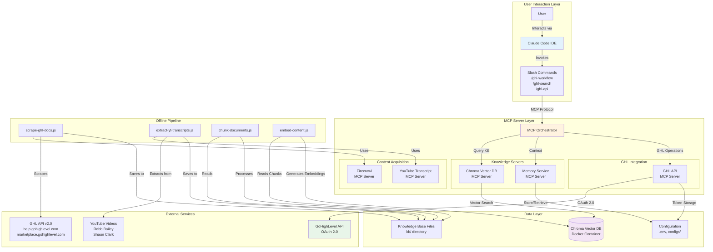

# 2. High-Level Architecture

### 2.1 Technical Summary

GHL Wiz employs a **modular RAG architecture** with **MCP-based microservices** for knowledge retrieval and API integration. The system consists of a **local vector database** (Chroma) storing embeddings generated from scraped documentation and YouTube transcripts, accessed through specialized **MCP servers** (Knowledge Base, GHL API, YouTube, Firecrawl). Users interact via **Claude Code slash commands** that orchestrate queries to these MCP servers. The **knowledge pipeline** is an offline batch process (scraping, chunking, embedding generation) that populates the vector database. All components run **locally on Windows** using Node.js, TypeScript, and Docker, with OAuth 2.0 authentication for GoHighLevel API integration and automatic token refresh.

##

 2.2 Platform and Infrastructure Choice

**Platform:** Local Windows Desktop (MVP) → Cloud-Ready Architecture (Future)

**Key Services:**
- **Compute**: Node.js 20+ runtime for MCP servers and scripts
- **Storage**:
  - Chroma Vector DB (Docker container, localhost:8000)
  - Local filesystem for knowledge base content (kb/ directory)
  - Encrypted local storage for OAuth tokens
- **Orchestration**: Claude Code MCP configuration (.claude/settings.local.json)
- **Container Runtime**: Docker Desktop for Chroma deployment

**Deployment Host:** User's local Windows machine

**Future Cloud Migration Path:**
- **Vector DB**: Chroma on cloud VM (Azure, AWS, GCP) or managed service
- **MCP Servers**: HTTP transport to cloud functions (Azure Functions, AWS Lambda)
- **Knowledge Base**: Cloud object storage (Azure Blob, S3, GCS)

**Rationale**: Local-first eliminates latency, cost, and privacy concerns for MVP while maintaining cloud-ready architecture for scaling.

### 2.3 Repository Structure

**Structure:** Monorepo

**Rationale:** Single repository simplifies dependency management, versioning, and deployment for a project with tightly coupled components (MCP servers, scripts, slash commands, knowledge base).

**Directory Layout:**

```
C:\Users\justi\BroBro\
├── .bmad-core/                  # BMAD framework files
├── .claude/
│   ├── commands/                # Slash command definitions
│   │   ├── BMad/                # BMAD agent commands
│   │   └── ghl/                 # Custom GHL slash commands
│   └── settings.local.json      # MCP server configuration
├── mcp-servers/
│   ├── ghl-api-server/          # Custom GHL API MCP server
│   │   ├── src/
│   │   │   ├── index.ts         # FastMCP server entry point
│   │   │   ├── tools/           # MCP tool implementations
│   │   │   │   ├── workflows.ts
│   │   │   │   ├── contacts.ts
│   │   │   │   ├── funnels.ts
│   │   │   │   ├── forms.ts
│   │   │   │   └── calendars.ts
│   │   │   └── auth/
│   │   │       └── oauth.ts     # OAuth 2.0 implementation
│   │   ├── dist/                # Compiled JavaScript
│   │   ├── package.json
│   │   └── tsconfig.json
│   └── README.md
├── scripts/                      # Knowledge base pipeline
│   ├── scrape-ghl-docs.js       # Firecrawl documentation scraper
│   ├── extract-yt-transcripts.js # YouTube transcript extractor
│   ├── chunk-documents.js        # Semantic chunking
│   ├── embed-content.js          # Embedding generation
│   ├── build-knowledge-base.js   # Orchestration script
│   └── utils/                    # Shared utilities
├── kb/                           # Knowledge base content
│   ├── youtube-sources.json      # YouTube content configuration
│   ├── ghl-docs/
│   │   ├── raw/                  # Scraped HTML/Markdown
│   │   └── processed/            # Chunked content
│   ├── youtube-transcripts/
│   │   ├── by-creator/
│   │   ├── by-topic/
│   │   └── index.json
│   ├── best-practices/
│   ├── snapshots-reference/
│   └── html-templates/
├── config/                       # Configuration files
│   ├── mcp-servers.json          # MCP server registry
│   ├── embedding-config.json     # Embedding model settings
│   ├── chunking-strategy.json    # Chunking parameters
│   └── ghl-api-scopes.json       # OAuth scopes
├── docs/                         # Documentation
│   ├── prd.md
│   ├── architecture.md (this file)
│   └── project-brief.md
├── tests/                        # Test suites
│   ├── mcp-servers/
│   └── knowledge-base/
├── chroma_db/                    # Chroma persistent storage (gitignored)
├── .env                          # Environment variables (gitignored)
├── .env.example                  # Template
├── .gitignore
├── package.json
├── tsconfig.json
└── README.md
```

### 2.4 High-Level Architecture Diagram



### 2.5 Architectural Patterns

**Pattern Selection & Rationale:**

- **Model Context Protocol (MCP) Microservices:** Modular server architecture where each MCP server is an independent microservice providing specific tools. *Rationale:* Enables independent development, testing, and deployment of knowledge retrieval, API integration, and content acquisition components.

- **Retrieval-Augmented Generation (RAG):** Semantic search over vector database to augment LLM responses with domain-specific knowledge. *Rationale:* Provides factual, up-to-date answers from indexed GHL documentation and tutorials, reducing hallucinations.

- **Offline Batch Processing:** Knowledge base construction (scraping, chunking, embedding) runs as offline batch scripts, not real-time. *Rationale:* Separates expensive indexing from fast query serving, allows for optimized batch operations.

- **Local-First Architecture:** All components run on user's machine with no cloud dependencies. *Rationale:* Zero latency, no recurring costs, privacy-first, simple deployment for MVP.

- **Command Pattern (Slash Commands):** Slash commands as user interface layer invoking MCP server tools. *Rationale:* Declarative, self-documenting interface with clear separation between UI and business logic.

- **Repository Pattern (MCP Tools):** Abstract GHL API operations behind MCP tool interfaces. *Rationale:* Decouples slash commands from API implementation, enables testing with mocks, future API version migration.

- **OAuth 2.0 with Token Refresh:** Automatic token refresh before expiry. *Rationale:* Seamless authentication without user intervention, handles 24-hour token expiry gracefully.

- **Semantic Chunking:** Content split on semantic boundaries (headings, paragraphs) rather than fixed character counts. *Rationale:* Preserves context, improves embedding quality, enhances search relevance.

- **Vector Collections as Namespaces:** Separate Chroma collections for docs, tutorials, best practices, snapshots. *Rationale:* Enables filtered search (e.g., "search only tutorials"), metadata-based retrieval, organized knowledge structure.

---

