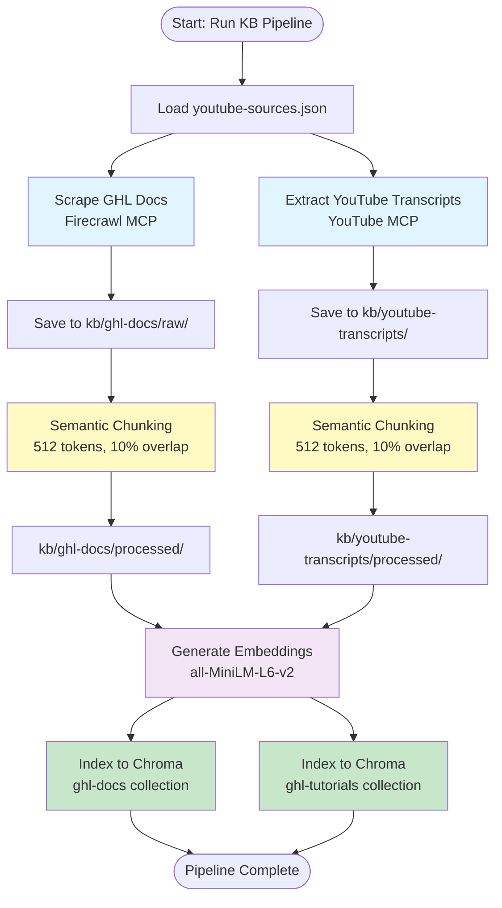

# 5. Knowledge Base Architecture

### 5.1 Data Flow: Content Ingestion Pipeline



### 5.2 Semantic Chunking Algorithm

**Implementation:** `scripts/chunk-documents.js`

```javascript
// Semantic Chunking Strategy

const CHUNK_SIZE = 512;      // tokens
const OVERLAP = 0.10;        // 10%
const OVERLAP_TOKENS = 51;   // 512 * 0.10

function semanticChunk(document) {
  // 1. Parse document structure
  const sections = parseMarkdown(document); // headings, paragraphs, code

  // 2. Tokenize each section
  const tokenized = sections.map(s => ({
    ...s,
    tokens: tokenize(s.content),
    tokenCount: countTokens(s.content)
  }));

  // 3. Group into chunks respecting semantic boundaries
  const chunks = [];
  let currentChunk = [];
  let currentTokens = 0;

  for (const section of tokenized) {
    // If adding section exceeds limit
    if (currentTokens + section.tokenCount > CHUNK_SIZE) {
      // Save current chunk if not empty
      if (currentChunk.length > 0) {
        chunks.push({
          content: currentChunk.join('\n\n'),
          tokens: currentTokens,
          metadata: extractMetadata(currentChunk)
        });
      }

      // Start new chunk with overlap from previous
      currentChunk = getOverlap(chunks[chunks.length - 1], OVERLAP_TOKENS);
      currentTokens = countTokens(currentChunk.join('\n\n'));
    }

    // Add section to current chunk
    currentChunk.push(section.content);
    currentTokens += section.tokenCount;
  }

  // Save final chunk
  if (currentChunk.length > 0) {
    chunks.push({
      content: currentChunk.join('\n\n'),
      tokens: currentTokens,
      metadata: extractMetadata(currentChunk)
    });
  }

  return chunks;
}

function getOverlap(previousChunk, overlapTokens) {
  // Extract last N tokens from previous chunk for context continuity
  const prevContent = previousChunk.content;
  const prevTokens = tokenize(prevContent);
  const overlapStart = Math.max(0, prevTokens.length - overlapTokens);
  return detokenize(prevTokens.slice(overlapStart));
}
```

### 5.3 Embedding Generation

**Model:** `sentence-transformers/all-MiniLM-L6-v2`

**Specifications:**
- **Dimensions:** 384
- **Max Sequence Length:** 256 tokens
- **Performance:** 14.7ms / 1K tokens
- **Accuracy:** 84-85% on semantic similarity benchmarks

**Implementation:** `scripts/embed-content.js`

```javascript
import { pipeline } from '@xenova/transformers';

// Load model (cached after first run)
const embedder = await pipeline('feature-extraction', 'Xenova/all-MiniLM-L6-v2');

async function generateEmbedding(text) {
  const output = await embedder(text, {
    pooling: 'mean',
    normalize: true
  });

  return Array.from(output.data); // 384-dimensional vector
}

async function batchEmbed(chunks) {
  const embeddings = [];

  for (const chunk of chunks) {
    const embedding = await generateEmbedding(chunk.content);

    embeddings.push({
      id: chunk.id,
      embedding: embedding,
      metadata: chunk.metadata,
      document: chunk.content
    });
  }

  return embeddings;
}
```

### 5.4 Vector Database Schema

**Chroma Configuration:**

```yaml
# Chroma running in Docker
# docker run -p 8000:8000 -v ./chroma_db:/chroma/chroma chromadb/chroma

Collections:
  ghl-docs:
    size: ~5,000 vectors (estimated)
    sources: help.gohighlevel.com, marketplace.gohighlevel.com/docs
    update_frequency: monthly

  ghl-tutorials:
    size: ~2,000 vectors (50-100 videos * ~20-40 chunks each)
    sources: YouTube transcripts (Robb Bailey, Shaun Clark, GHL Official)
    update_frequency: quarterly

  ghl-best-practices:
    size: ~500 vectors
    sources: curated guides, community knowledge
    update_frequency: as-needed

  ghl-snapshots:
    size: ~200 vectors
    sources: marketplace snapshot information
    update_frequency: quarterly

Total Estimated Vectors: ~7,700
Total Storage: ~11 MB (7,700 * 384 dims * 4 bytes)
```

**Index Configuration:**

```python
# Chroma uses HNSW (Hierarchical Navigable Small World) by default
# Optimized for fast approximate nearest neighbor search

collection.modify(
    metadata={
        "hnsw:space": "cosine",        # cosine similarity for semantic search
        "hnsw:construction_ef": 200,   # higher = better recall, slower indexing
        "hnsw:search_ef": 100,         # higher = better recall, slower queries
        "hnsw:M": 16                   # connections per layer
    }
)
```

---

