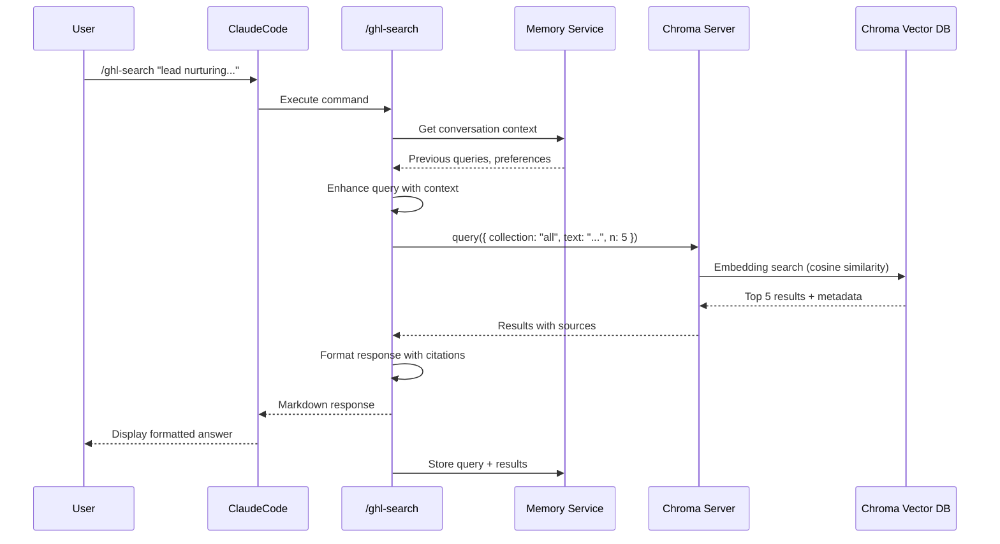
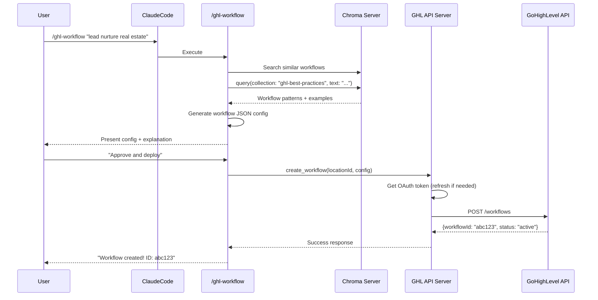
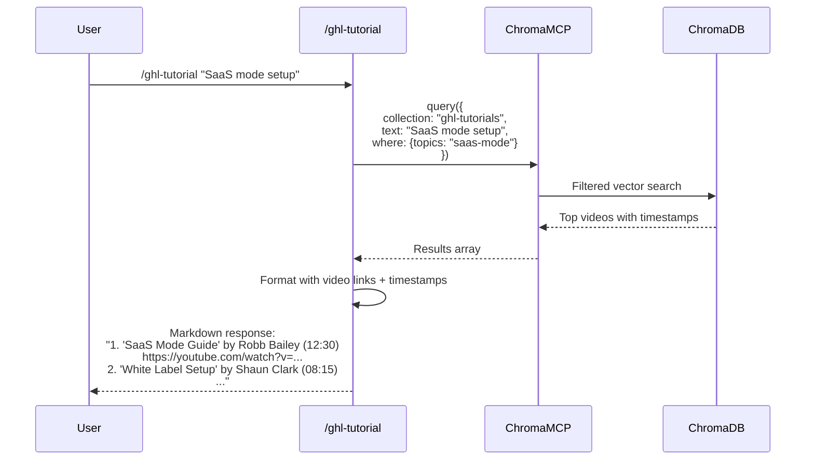

# 6. Request/Response Flows

### 6.1 Knowledge Query Flow

**User invokes:** `/ghl-search "lead nurturing workflow best practices"`

**Latency Budget:**
- Embedding generation: ~15ms
- Vector search: ~50ms
- Result formatting: ~10ms
- **Total: ~75ms** (well under 2 second requirement)

### 6.2 Workflow Creation Flow

**User invokes:** `/ghl-workflow "create lead nurture for real estate"`

### 6.3 Tutorial Discovery Flow

**User invokes:** `/ghl-tutorial "SaaS mode setup"`

---

